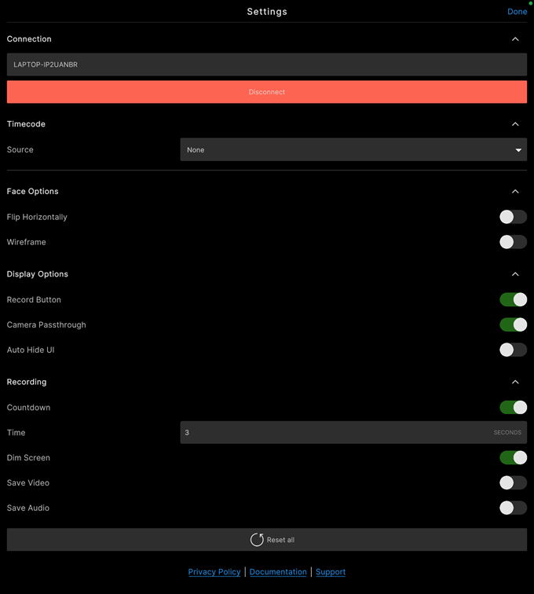

# Face Capture settings

To access the app settings, tap the gear icon at the top left of the screen.

| Settings category | Purpose |
| :--- | :--- |
| **[Connection](#connection)** | Manage the app connection to a Live Capture server. |
| **[Timecode](#timecode)** | Connect the app to a timecode source for time synchronization purposes. |
| **[Face Options](#face-options)** | Adjust face tracking behavior and visualize face movement tracking. |
| **[Display Options](#display-options)** | Show/hide elements of the app main screen. |
| **[Recording](#recording)** | Configure the pre-recording countdown and enable recording options: dim screen, and enable video and audio recording. |
| **Reset all** | Reset all app settings to their default values. |
| [Links](#links) | Get more information and support about the app. |

## Connection

The Connection settings allow you to manage the connection of the app to a Live Capture server through your local network.

### When the app is already connected

| Property | Description |
| :--- | :--- |
| _Host name_ | The name of the computer hosting the server. |
| **Disconnect** | Disconnects the app from the server. |

### If the app is disconnected

| Property | Description |
| :--- | :--- |
| **Scan** | Allows you to select a server to connect to among the currently available ones. |
| **Manual** | Allows you to specify the IP address and port of the server you wish to connect to. |
| _Host name_, or **IP** and **Port** | Specify the information to reach the computer hosting the server you want to connect the app to.  • In **Scan** mode, select the host name. • In **Manual** mode, specify the host IP address and the server port. |
| **Connect** | Connects the app to the specified server. |

>**Note:** To manage the connection on the server side, use Unity Editor's [Connection Window](ref-window-connections.md).

## Timecode

Use the Timecode settings to connect the app to a timecode source for [time synchronization](timecode-synchronization.md) with the Unity Editor and other Live Capture compatible devices.

| Property | Description |
| :--- | :--- |
| **Source** | The source to use for [timecode synchronization](timecode-synchronization.md).  **Note:** Make sure to enable Bluetooth on your mobile device to allow the app to detect the timecode source device to connect to. |

## Face Options

Use the Face Options to adjust face tracking behavior in Unity and visualize face movement tracking for debugging purposes.

| Property | Description |
|:---|:---|
| **Flip Horizontally** | Flips horizontally all face and head movements transmitted to the Unity Editor.  As a result, the controlled character face moves in the Scene as if you were looking in a mirror. |
| **Wireframe** | Displays a mesh visualizer of the face, which can help you debugging the face tracking quality. |

## Display Options

Use the Display Options to show or hide elements of the app main screen.

| Property | Description |
|:---|:---|
| **Record Button** | Toggles the visibility of the record button.  You might need to hide the Record button when you want to control the recording exclusively from the Unity Editor. |
| **Camera Passthrough** | Enables or disables the video feed from the mobile device's camera.  When you disable camera passthrough, you can't see yourself on the screen of the device, but the app still captures your face and head movements and transmits them to the Unity Editor. |
| **Auto Hide UI** | Enable this option to make the controls of the app's main screen fade away after a few seconds when you're not interacting with them.  Touch the screen to display the interface controls when they're hidden. |

## Recording

Use the Recording settings to configure the pre-recording countdown and enable other recording options.

| Property | Description |
|:---|:---|
| **Countdown** | Use this option to enable or disable the pre-recording countdown.  The actual recording starts when the countdown ends. |
| **Time** | The duration of the pre-recording countdown in seconds. |
| **Dim Screen** | Hides the app controls and dims the screen during the recording.  You might need to enable this option to minimize the performer distraction and save on the mobile device battery during the recording. |
| **Save Video** | Enable this option to capture a video of your face performance from the mobile device front camera while recording the face animation.  The app saves the video recordings as MP4 files in `Files/Face Capture/Recordings/Video`. |
| **Save Audio** | Enable this option to capture your voice or any other ambient sound from the mobile device microphone while recording the face animation.  The app saves the audio recordings as WAV files in `Files/Face Capture/Recordings/Audio`. |

## Links

Use the links to get more information and support about the app.

| Link | Description |
| :--- | :--- |
| **Privacy Policy** | Links to Unity's [Privacy Policy](https://unity3d.com/legal/privacy-policy), which governs the collection, use, storage, and sharing of the information Unity collects or receives from you. |
| **Documentation** | Links to the [Unity Face Capture page](face-capture.md) of this documentation. |
| **Support** | Links to the official [Unity forum post](https://forum.unity.com/threads/1111255/) about the Live Capture apps, from where you can get general information and support, and provide some feedback on the apps. |
