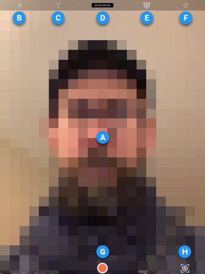

# Face Capture app interface reference

|  | Name | Description |
| :--- | :--- | :--- |
| **A** | Face tracking area | The area your face must fit in to allow the app to track your face and head movements.  The app displays a mirrored view of your face through the mobile device front camera, which allows you to conveniently monitor your performance and keep your face inside the boundaries of the tracking area. |
| **B** | [Settings](face-capture-app-ui-settings.md) | Icon to access settings relative to connection, timecode, face tracking, app screen display, and recording. |
| **C** | Take number | The number of the current recording take, or if you're not recording, the number of the next take to record. |
| **D** | Timecode | The current timecode (hr:min:sec:frame) of the current recording take. |
| **E** | Face tracking indicator | Indicates the current face tracking status.  This indicator becomes red when the app is unable to detect a face, for example when the face is partially or totally outside the tracking area boundaries. |
| **F** | Help | Tap this icon to enter or exit the app Help Mode.  In Help Mode, tap any control to display a tooltip describing its function. |
| **G** | Record button | Use this button to start/stop recording a face animation take.  When you start a recording, the app displays a pre-recording countdown and then sends a command to the Unity Editor to start recording a take. |
