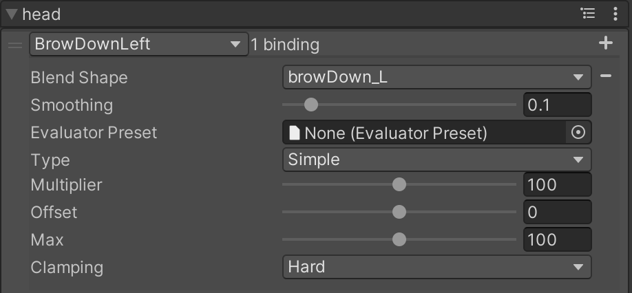
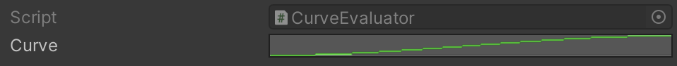

# Using ARKit Mapping Evaluators

| Field            | Description                                                  |
| ---------------- | ------------------------------------------------------------ |
| +/-              | Add or remove a binding. Note that there can be more than one blendshape bound to a single ARKit input value. |
| Override Smoothing        | Enable to override the smoothing value set by the mapper. |
| Smoothing        | The amount of smoothing to apply to the blend shape value. It can help reduce jitter in the face capture, but it will also smooth out fast motions. |
| Evaluator Preset | A preset evaluation function to use. If none is assigned, a new function must be configured for this blendshape. |
| Type             | The type of evaluation function to use when a preset is not assigned. This can be either **Simple** or **Curve**. |
| Multiplier       | The scaling coefficient applied to the blend shape value. Larger values make the character more expressive. |
| Offset           | Offsets the zero value of the blend shape. Non-zero values will change the face's resting pose. |
| Max              | The maximum value of the blendshape.                         |
| Clamping         | Controls how the evaluated blend shape value should behave as it reaches the maximum value. Soft clamping will ease near the max value, while hard clamping will not. |

## Evaluator Presets

Evaluator Presets simplify the process of applying the same evaluation parameters across many blendshape mappings. 

To create a new Evaluator Preset, go to `Assets > Create > Live Capture > ARKit Face Capture > Evaluator` and select either **Simple** or **Curve**.

**Simple Evaluator**

An Evaluator that uses a mostly linear evaluation function.

**Curve Evaluator**

An Evaluator that uses an animation curve to define a custom function. Click the animation curve to define a curve manually or pick one from a list of presets.

The created preset asset can be applied to the **Evaluator Preset** field of any mapping in the **Mapper**.