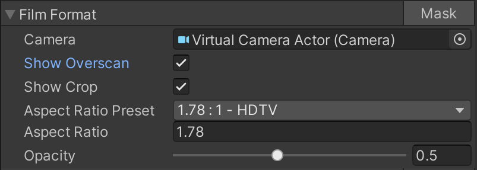

# Film Format

Use Film Format to render letter/pillar boxes that represent the sensor size and/or aspect ratio of a target format. When using URP, the `VirtualCameraScriptableRenderFeature` must be enabled on the project's `UniversalRenderPipelineAsset`, this can be done by pressing the **Add VirtualCameraScriptableRenderFeature render feature** button.

| **Property**       | **Function**                                                 |
| :-------------- | :----------------------------------------------------------- |
| __Camera__ | The camera to draw the format mask to. |
| __Show Overscan__ | Show where the resolution gate (the aspect ratio of the display) is rendering more than the film gate (the aspect ratio from the sensor). |
| __Show Crop__ | Toggle the visibility of the crop mask. |
| __Aspect Ratio Preset__ | Select a crop aspect ratio from a list of common values. |
| __Aspect Ratio__ | Introduce a custom crop aspect ratio value manually. |
| __Opacity__ | The opacity of the mask. |

