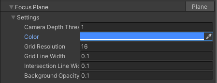

# Focus Plane

Use Focus Plane to render a visualization of the focus plane (that is, the plane facing the camera whose distance to it corresponds to the focus distance).
For example, this may be useful to visualize how focus distance behaves depending on the current focus mode.

When using URP: 
- You must enable the `VirtualCameraScriptableRenderFeature` on the project's `UniversalRenderPipelineAsset`: select the **Add VirtualCameraScriptableRenderFeature render feature** button.
- **Camera Depth Texture** must be enabled on the active renderer settings, this can be done by pressing the **Activate Camera Depth Texture** button.

| **Property**       | **Function**                                                 |
| :-------------- | :----------------------------------------------------------- |
| __Camera Depth Threshold__ | The camera-space depth to render the focus plane at, will be driven by focus distance. |
| __Color__ | The color of the focus plane. |
| __Grid Resolution__ | The resolution of the focus plane grid. |
| __Grid Line Width__ | The width of the focus plane grid lines. |
| __Intersection Line Width__ | The thickness of the intersection line between the focus plane and the scene geometry. |
| __Background Opacity__ | The opacity of the focus plane background (grid cells). |

