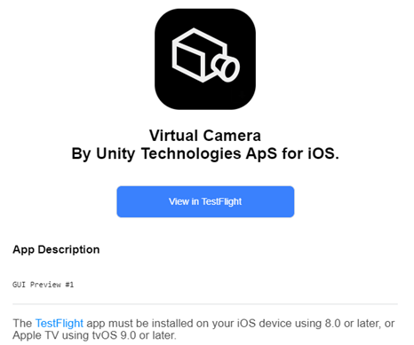

# Installing the apps on your iOS device

**Important:** Before you request and install an app, verify if your iOS device can support it:

| **App**        | **Supported iOS devices** |
|----------------|---------------------------|
| Virtual Camera | iPad with ARKit capabilities: • iPad Pro • iPad Air (3rd gen or later) • iPad mini (5th gen or later) • iPad (5th gen or later). |
| Face Capture   | iPhone or iPad with ARKit face tracking capabilities: • See the [full list on apple Website](https://support.apple.com/en-us/HT209183). |

For the full list of requirements, see the section dedicated to each app:
* [Virtual Camera App requirements](requirements.md)
* [Face Capture App requirements](live-capture-face-requirements.md)

**Note:** The Virtual Camera and Face Capture apps are currently distributed via TestFlight and target iOS devices.

To get and install the apps:

1.  Install [TestFlight](https://testflight.apple.com) on your iPad.

2.  Request access to the the app(s) by email:

    a.  As the sender, use the email address that is linked to your Apple ID.

    b.  Specify the apps you want access to: Virtual Camera, Face Capture, or both.

    c.  Address the email to <guillaume.levasseur@unity3d.com>.

   >**Note:** Once we approve and process your request, you should receive a TestFlight invitation by email for each app you requested.

3.  Redeem your invitation from your iOS device: in the received email, tap the **View in TestFlight** button.

    

4.  Install the latest version of the app from TestFlight.
