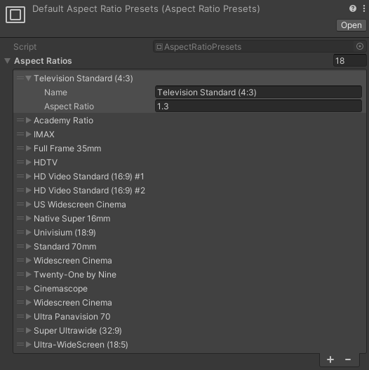

# Aspect Ratio Presets

A pre-configured set of aspect ratios.

The Live Capture package includes a default list of common aspect ratios.

## Creating a new preset list

1. Go to **Assets > Create > Live Capture > Virtual Camera > Aspect Ratio Preset** to create a new preset list.
2. Expand the **Aspect Ratios** foldout and press the **+** button to create a new preset.
3. Enter a name for the preset.
4. Enter an aspect ratio (width / height) for the new preset.

## Using a defined preset

Select the active aspect ratio preset from the [Virtual Camera Device](ref-component-virtual-camera-device.md).

