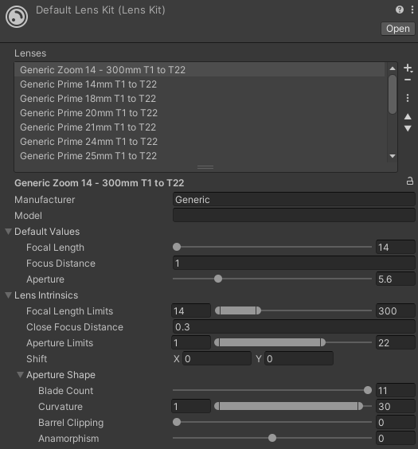

# Lens Kit

Lens kits are a convenient way to preconfigure sets of lens presets to use with the [Virtual Camera Device](ref-component-virtual-camera-device.md).

The Live Capture package includes a default lens kit.

## Creating a lens kit

1. Go to **Assets > Create > Live Capture > Virtual Camera > Lens Kit** to create a new lens kit.
2. Click the **+** button to create a new lens preset.
3. (Optional) Enter a **Manufacturer** and **Model** name. These will be automatically used in the name of the lens preset.
4. Define the **Default Values**. These are the values for Focal Length, Focus Distance, and Aperture (f-number) used when you initially select the lens preset.
5. Define the **Lens Instrinsics**. For more information see [Virtual Camera Lenses](virtual-camera-lenses.md).

## Using a lens from a lens kit

Select the lens kit from the **Lens Asset** dropdown on the [Virtual Camera Device](ref-component-virtual-camera-device.md).
