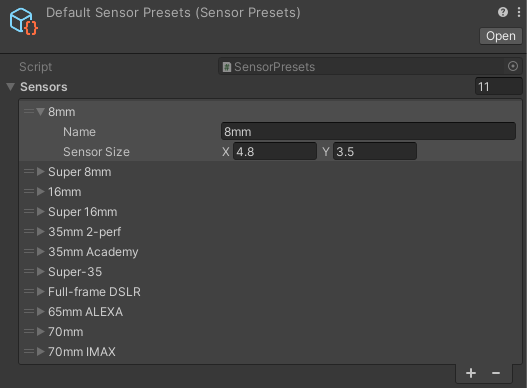

# Sensor Presets

Sensor Presets provide an easy way to define new presets for camera sensor sizes to use with a [Virtual Camera Device](ref-component-virtual-camera-device.md).

The Live Capture package includes a default list of presets.

## Creating a new set of presets

1. Go to **Assets > Create > Live Capture > Virtual Camera > Sensor Presets** to create a new list of presets.
2. Expand the **Sensors** foldout and press the **+** button to create a new preset.
3. Enter a name for the preset.
4. Enter a sensor size, in mm, for the new preset.

## Using a sensor preset

Select the active sensor preset from the **Sensor Preset** field under **Camera Body** on the [Virtual Camera Device](ref-component-virtual-camera-device.md).