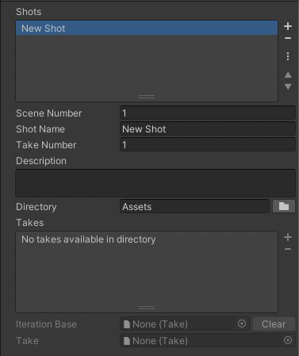

# Shot Library

Shot Library is an asset that stores shot definitions. They are a convenient way to preconfigure sets of shots to use with the [Shot Player](ref-component-shot-player.md).

## Creating a Shot Library

1. Go to **Assets > Create > Live Capture > Shot Library** to create a new shot library.
2. Click the **+** button to create a new shot.
3. Enter the slate information of the shot: **Scene Number**, **Shot Name**, **Take Number** and **Description**. These will be automatically used when recording new takes.
4. Define the output **Directory**. All recorded takes will be stored in that directory.
5. Pick the selected take from the **Takes** list. The list will show the available takes in the output directory.
6. Drag and drop the asset to the scene to create a [Shot Player](ref-component-shot-player.md) and start previewing recorded takes.
