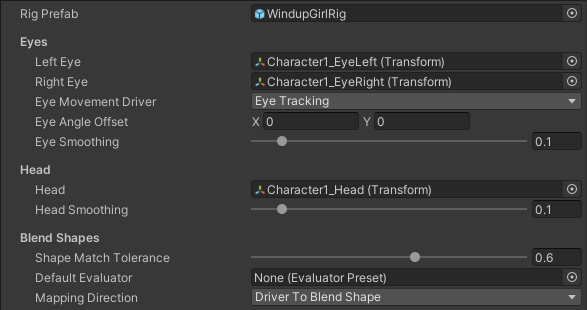

# Default Face Mapper

See also [Mapping Evaluator](face-capture-mapping-evaluator.md).

## Setting up a character

1. Add a ARKit Face Actor component **to your character prefab** by clicking **Add Component > Live Capture > ARKit Face Capture > ARKit Face Actor**.

2. Create a new Mapper asset by going to **Assets > Create > Live Capture > ARKit Face Capture > Mapper**.

3. In the inspector, assign a prefab of the character from your project view to the **Rig Prefab** field.

4. Assign the new mapper asset to the new **ARKit Face Actor** component.

5. Select the new Mapper asset in the Project window and lock the inspector so that the Mapper inspector stays visible.

6. Open the character prefab.

7. To drive eye movement, assign the character's eye transforms to the **Left Eye** and **Right Eye** fields in the mapper.

8. Configure how eye movement is driven.

| Fields     | Description |
| ---- | ----|
| Eye Movement Driver     |  Eye Tracking: Use value from ARKit's built-in eye tracking. Blend Shapes: Infer eye orientation from blend shape values. |
| Eye Angle Offset | The horizontal and vertical angles in degrees by which to offset the resting position for the eyes. |
| Eye Smoothing | The amount of smoothing to apply to eye movement. It can help reduce jitter in the face capture, but it will also smooth out fast motions. |
| Eye Angle Range | Only available when **Eye Movement Driver** is set to **Blend Shapes**. The horizontal and vertical arcs in degrees over which the eyes can rotate. |

9. To drive head position, assign the character's head position anchor transform to the **Head Position** field
10. To drive head rotation, assign the character's head rotation pivot transform to the **Head Rotation** field
11. Configure how the head is driven.

It is recommended that you do not drive head movement directly.

* If you are driving movement for an entire character using a full mocap setup, use the data from your body tracking solution to get head movement.
* For best results, use a **Constraint** component from the [Animation Rigging](https://docs.unity3d.com/Packages/com.unity.animation.rigging@1.0/manual/index.html) package to more realistically drive head movement accounting for neck bone rotation.

**Head Smoothing** The amount of smoothing to apply to head movement. It can help reduce jitter in the face capture, but it will also smooth out fast motions.

12. In the mapper inspector, click the **Add Renderer** button and add each renderer that has blend shapes that will be driven by the Face Capture app.

13. Expand a renderer to set the mapping between ARKit values and specific blend shapes. Set the **Mapping Direction** to switch between ARKit-to-blend shape and blend shape-to-ARKit.

The system will attempt to auto-match ARKit input values to blendshapes using their names as a starting point. Use the **Shape Match Tolerance** field to set the  threshold determining how close a mesh blend shape name must be to an ARKit input value name to automatically be bound. To change the tolerance of the mapping, set the slider then click the vertical ellipsis to the right of a renderer binding and select **Initialize**.

13. (Optional) Create and assign a default evaluator to the **Default Evaluator** field to set the evaluator that each mapping will use if they don't have one assigned.
14. Set the **Blend Shape Smoothing** to use for all mappings unless overidden by a given mapping.

14. This inspector also exposes properties used to process the incoming value before applying it to the blendshape. Learn more about them in the [Mapping Evaluator section](face-capture-mapping-evaluator.md).

## Retargeting

A **Default Face Mapper** asset may be shared by different character rigs, with a few constraints.

* The paths from the **Face Actor** component to the transforms or meshes used in the mapper must be the same across the different characters. Therefore, character rigs should try to have consistent structure and naming conventions.
* If a rig does not have one of the transforms or meshes used in the mapper at the expected path, that part of the mapping will not be applied.
