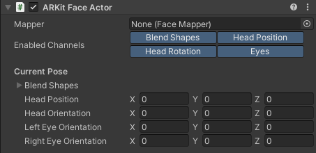

# ARKit Face Actor component

The ARKit Face Actor is a component that stores face properties. These properties are animated through animation clips, or through the [ARKit Face Device](ref-component-arkit-face-device.md) when the Take Recorder is in Live mode.

## General

| Property | Function |
|:---|:---|
| **Mapper** | The asset that configures how face pose data is mapped to this character's face rig. |
| **Enabled Channels** | The channels of face capture data to apply to this actor. This allows for recording all channels of a face capture, while later being able to use select parts of the capture. |

## Current Pose

| Property | Function |
|:---|:---|
| **Blend Shapes** | The blend shapes weights that define the face expression. |
| **Head Position** | The position of the head. |
| **Head Orientation** | The rotation of the head. |
| **Left Eye Orientation** | The rotation of the left eye. |
| **Right Eye Orientation** | The rotation of the right eye. |
