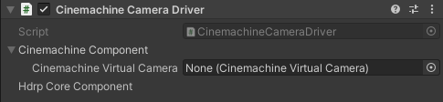

# Cinemachine Camera Driver component

The Cinemachine Camera Driver is a camera driver that uses a Cinemachine Virtual Camera as a backend. This driver applies the properties of the [Virtual Camera Actor](ref-component-virtual-camera-actor.md) to the specified Cinemachine Virtual Camera.

| Property | Function |
|:---|:---|
| **Cinemachine Virtual Camera** | Targets the Cinemachine Virtual Camera to use as a backend in the Scene. |
