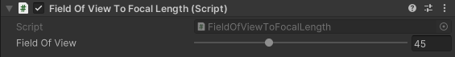

# Field of View To Focal Length

The Field of View To Focal Length component synchronizes the field of view of a camera with its focal length. When the camera is using physical properties, Unity ignores any field of view value set from an animation clip. This component allows the field of view to be animated while  maintaining the correct focal length. When not using physical properties, the component will update the field of view field to match the camera's one.

## Properties

| **Property** | **Function** |
|:---|:---|
| **Field Of View** | The field of view of the camera. |