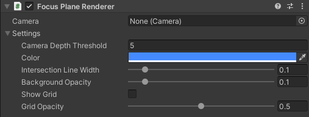
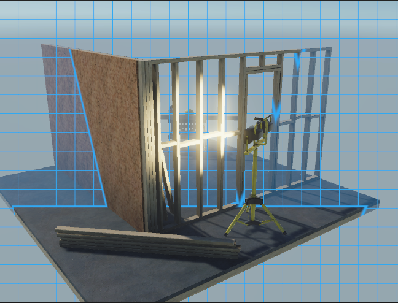

# Focus Plane Renderer component

The Focus Plane component allows you to render a visualization of the focus plane (that is, the plane facing the camera whose distance to it corresponds to the focus distance). For example, you might need to visualize how the focus distance behaves depending on the current focus mode.

## Properties

| **Property** | **Function** |
|:---|:---|
| **Camera** | The camera to apply the focus plane visualization to. If you add the Focus Plane component to a GameObject that has a Camera component, this property automatically targets this camera. |
| **Camera Depth Threshold** | The camera-space depth to render the focus plane at, driven by focus distance. |
| **Color** | The color of the focus plane. |
| **Intersection Line Width** | The thickness of the intersection line between the focus plane and the scene geometry. |
| **Background Opacity** | The opacity of the focus plane background. |
| **Grid** | Show the focus plane grid overlay. |
| **Grid Opacity** | The opacity of the focus plane grid overlay. |

---
## Using Focus Plane in URP

If you are using the Universal Render Pipeline (URP):
- You must enable the `VirtualCameraScriptableRenderFeature` on the project's `UniversalRenderPipelineAsset` by clicking the **Add VirtualCameraScriptableRenderFeature render feature** button.
- You must enable the **Camera Depth Texture** on the active renderer settings: press the **Activate Camera Depth Texture** button.

