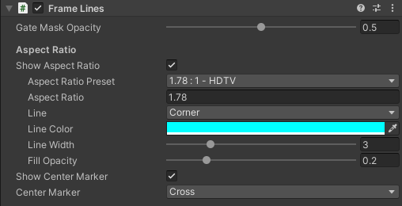
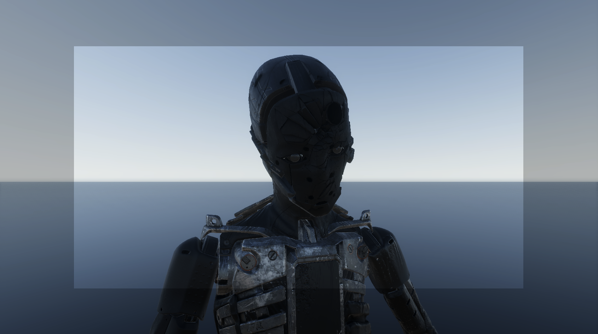

# Frame Lines component

The Frame Lines component allows you to:
* Render masks and markers in Game view to represent the camera sensor size and target format aspect ratio.
* Adjust the Game view relative to the sensor size.

>**Note:** In the context of Virtual Camera workflows, you must use the [Virtual Camera Device component](ref-component-virtual-camera-device.md) to edit some of the hereby described properties since the Virtual Camera Device drives the Frame Lines component.

The Frame Lines component automatically applies to any Camera component of the GameObject it belongs to. To be able to control the Frame Lines properties from the [Virtual Camera Device](ref-component-virtual-camera-device.md), you must ensure the Frame Lines component is on the same GameObject as the [Virtual Camera Actor](ref-component-virtual-camera-actor.md).

## Gate Properties

These properties apply to two complementary concepts related to the use of [Physical Cameras](https://docs.unity3d.com/Manual/PhysicalCameras.html) in Unity:
* The _film gate_ (or sensor gate), which represents the aspect ratio of the physical camera sensor.
* The _resolution gate_, which represents the aspect ratio of Unity's Game view.

| **Property** | | **Description** |
|:---|:---|:---|
| **Gate Fit** |  | Select a mode to fit the resolution gate relative to the film gate. |
|| Fill | The film gate optimally fills the whole resolution gate area. This crops the film gate. |
|| Overscan | The resolution gate includes the whole film gate area. This overscans the area outside of the film gate. |
| **Gate Mask** || Enable this option to display a mask outside the boundaries of the film gate.  **Note:** The actual visibility and size of the Gate Mask depend on the film gate and resolution gate aspect ratios, and on the selected **Gate Fit** mode. |
| **Opacity** || The opacity of the **Gate Mask**. |

## Aspect Ratio

| **Property** | **Description** |
|:---|:---|
| **Aspect Ratio Lines** | Enable this option to display the aspect ratio lines and mask in the Game view. |
| **Aspect Ratio Preset** | Select a crop aspect ratio from a list of common values. Controlled by the Virtual Camera Device when on the same Game Object as a Virtual Camera Actor. |
| **Aspect Ratio** | The current aspect ratio of the frame lines. Type a value in this field if you need to specify a custom aspect ratio. Controlled by the Virtual Camera Device when on the same Game Object as a Virtual Camera Actor. |
| **Type** | The type of lines to display to frame the cropped view: a four-**Corner** based frame, a whole **Box**, or **None**. |
| **Color** | The color of the frame lines. |
| **Width** | The width of the frame lines. |
| **Fill Opacity** | The opacity of the crop mask. |

## Center Marker

| **Property** | **Description** |
|:---|:---|
| **Center Marker** | Enable this option to display the center marker in Game view. |
| **Type** | The type of marker to materialize the center of the framed view: a **Cross** or a large **Dot**. |

---
## Using Frame Lines in URP

If you are using the Universal Render Pipeline (URP), you must enable the `VirtualCameraScriptableRenderFeature` on the project's `UniversalRenderPipelineAsset`.

To do this, press the **Add VirtualCameraScriptableRenderFeature** button.
