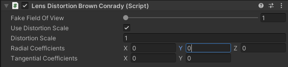

# Lens Distortion Brown Conrady

The Lens Distortion Brown Conrady component uses the Brown-Conrady distortion model to simulate the distortion of a physical lens. It is only available in HDRP.

## Properties

| **Property** | **Function** |
|:---|:---|
| **Fake Field Of View** | The field of view used for rendering. If this value is greater than the camera's field of view, the image will be cropped. This can be used to eliminate edge artifacts created during the distortion without using a second camera. |
| **Use Distortion Scale** | Whether to use the distortion scale. |
| **Distortion Scale** | The scale of the distortion effect. |
| **Radial Coefficients** | The radial distortion coefficients. |
| **Tangential Coefficients** | The tangential distortion coefficients. |