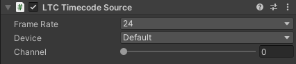

# LTC Timecode Source component

Add this component along with the [Timecode Synchronizer component](ref-component-timecode-synchronizer.md) to use a Linear timecode (LTC) audio signal as the timecode source.

To enable the Timecode Synchronizer to get a timecode from this component, you must connect an LTC-capable audio source to your Unity workstation.

**Known issue:** Audio inputs might be unavailable or inactive in Edit mode if you just launched the Unity Editor. To enable audio inputs for LTC in Edit mode, enter and exit the Play mode once.

## Properties

| Property | Function |
|:---|:---|
| **Frame Rate** | The frame rate of the timecode. |
| **Device** | The audio input port used to connect the audio source device that provides the timecode in the form of an LTC signal. |
| **Channel** | The audio channel that contains the LTC signal. |
