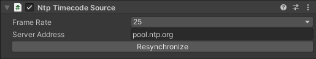

# NTP Timecode Source component

Add this component along with the [Timecode Synchronizer component](ref-component-timecode-synchronizer.md) to use a Network Time Protocol (NTP) server as the timecode source.

## Properties

| Property | Function |
|:---|:---|
| **Frame Rate** | The frame rate of the timecode. |
| **Server Address** | The hostname or IP address of the NTP server to get the time from. |

## Resynchronize

Use the **Resynchronize** button to manually poll the specified NTP server for the current time.

>**Note:** Enabling the component or modifying one of its properties also automatically triggers an update.
