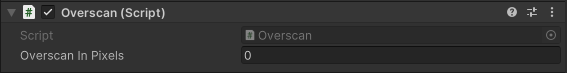

# Overscan

The Overscan component is used to add overscan to a camera. Overscan is the process of rendering a larger image than the final output resolution and then cropping the image to the desired resolution. This is useful for eliminating edge artifacts that can occur when rendering a camera's view to a texture. This component uses a second camera to render the overscanned image. The overscanned image is then cropped and presented to the camera that this component is attached to. This component is only compatible with the High Definition Render Pipeline.

## Properties

| **Property** | **Function** |
|:---|:---|
| **Overscan In Pixels** | The number of pixels to overscan. |