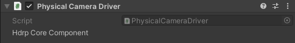

# Physical Camera Driver component

The Physical Camera Driver is a camera driver that uses a Camera component as a backend. This driver applies the properties of the [Virtual Camera Actor](ref-component-virtual-camera-actor.md) to the Camera component that belongs to the same GameObject.

This component has no editable properties.
