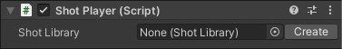
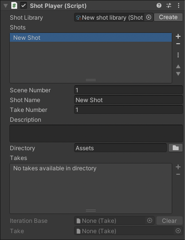

# Shot Player component

The Shot Player component manages the playback of shots stored in a [Shot Library](ref-asset-shot-library.md) asset.

The component prepares the PlayableDirector found in the same GameObject with the Timeline asset of the selected take. You can then review the take by playing the PlayableDirector or by using the Timeline window.

It also integrates with the [Take Recorder window](ref-window-take-recorder.md), by selecting the **Shot Library** mode and picking the desired Shot Player component from the dropdown list.

To use the Shot Player component, you must create a dedicated Shot Player GameObject in your Scene Hierarchy: **Live Capture > Shot Player**

| **Property** | **Description** |
|:---|:---|
| **Shot Library** | The Shot Library asset to use as source. Press the **Create** button to create and assign a new Shot Library asset. |

Once the Shot Library is set, you can select the desired shot from the **Shots** list.
You can make modifications to the [Shot Library](ref-asset-shot-library.md) asset right from the inspector itself.
