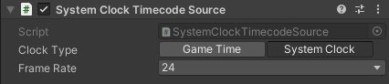

# System Clock Timecode Source component

Add this component along with the [Timecode Synchronizer component](ref-component-timecode-synchronizer.md) to use the system clock as the timecode source.

**Note:** This component might provide inaccurate results if you use it to synchronize data sources. Therefore, you should only use it for testing purposes, or to simply get a timecode reference in your Game view without connecting external devices.

## Properties

| Property | Function |
|:---|:---|
| **Clock Type** | The source clock to use to provide the timecode. • **Game Time** provides a timecode derived from the Unity Editor time. • **System Clock** provides a timecode derived from the Operating System time. |
| **Frame Rate** | The frame rate of the timecode. |
