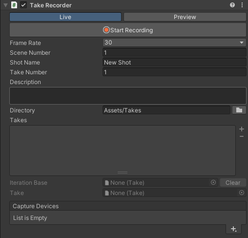

# Take Recorder component

The Take Recorder component is responsible for recording, managing, and playing back Live Capture takes.

To use the Take Recorder component, you must create a dedicated Take Recorder GameObject in your Scene Hierarchy: **Live Capture > Take Recorder**

## Recording and playback

All controls and properties to record and play back Live Capture takes.

| Control/property | Description |
|:---|:---|
| **Live** | Sets the Take Recorder in Live mode, which allows you to capture and record takes through connected apps. |
| **Playback** | Sets the Take Recorder in Playback mode, which allows you to play back takes in the Unity Editor and on the connected apps. |
| **Start/Stop Recording** | Allows you to start and stop the recording of a take according to the current connected apps. This button is only available when you set the Take Recorder in Live mode.  **Note:** When you start and stop a recording from a connected app, the status of this button updates accordingly in the Unity Editor. |
| **Start/Stop Preview** | Allows you to start and stop playing back a take according to the current connected apps. This button is only available when you set the Take Recorder in Playback mode.  **Note:** When you start and stop playing back a take from a connected app, the status of this button updates accordingly in the Unity Editor. |

## Slate/take properties

The slate information and take properties to use when recording takes.

| Property | Description |
|:---|:---|
| **Frame Rate** | The frame rate to use for recording. |
| **Scene Number** | The number of the scene for which you record the shots. |
| **Shot Name** | The name of the shot. |
| **Take Number** | The take index of the shot. |
| **Description** | The description of the shot. |

### Take metadata

Each recorded take holds the specified information as take metadata to help you organize your shots.

### Take names
The Take Recorder names the recorded takes with the following syntax: `[Scene Number] Shot Name [Take Number]`, with numbers displayed on three digits. For example: `[001] My Shot [006]`.

## Take management

| Property | Description |
|:---|:---|
| **Directory** | The path where the Take Recorder stores the recorded takes. To change the path, type in the field or use the folder button at the right. |
| **Takes** | The list of recorded takes currently available in the directory. |
| **Iteration Base** | The take to play and iterate on in a recording session. • To set this property, select in the Take list the take to iterate on and click on the red button at its right. • To clear this property when you want to record a new take without iterating on an existing one, use the **Clear** button at the right of the field. |
| **Take** | The current take selected in the **Takes** list. |
| **Bindings** | The list of referenced GameObjects that the selected take uses. |

## Capture Devices

The list of available Live Capture Devices to use for a take recording session.

* Use the **+** (plus) button to add a Capture Device to the list.
  **Note:** You still need to configure the added Device to bind it to a connected Client Device and to an Actor in the Scene.

* Enable or disable Devices in the list to make them participate or not in a recording session.
