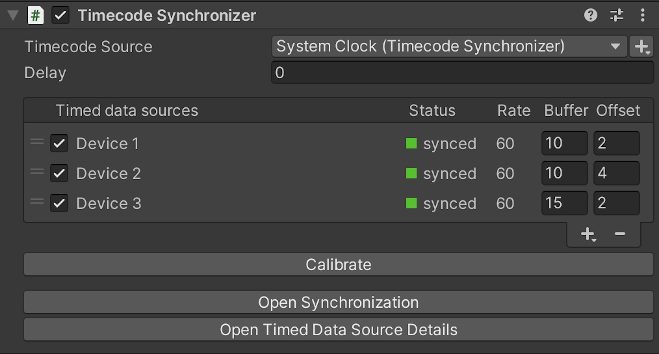

# Timecode Synchronizer component

Use this component in any GameObject of your current Scene to enable timecode synchronization between compatible Live Capture devices connected to the Unity Editor.

To get a functional Timecode Synchronizer, you must use this component along with another component according to the timecode source you need to use: [LTC Timecode Source](ref-component-ltc-timecode-source.md), [NTP Timecode Source](ref-component-ntp-timecode-source.md), or [System Clock Timecode Source](ref-component-system-clock-timecode-source.md).

## General properties

| Property            | Function                                                                                                                                                                                                                                                                                                                                                                   |
|:--------------------|:---------------------------------------------------------------------------------------------------------------------------------------------------------------------------------------------------------------------------------------------------------------------------------------------------------------------------------------------------------------------------|
| **Timecode Source** | The timecode source to use as the reference for synchronizing all your connected data sources.  The dropdown list includes all timecode source components present in any GameObject of the current Scene. The mention in parentheses indicates the name of the GameObject that holds the component.  Use the + (plus) button to add a new timecode source. |
| **Delay**           | The delay (in frames) applied to the source timecode. Use a positive value to compensate for high-latency data sources.                                                                                                                                                                                                                                                    |

## Timed data sources

| Property        | Function                                                                                                                                                                                                                                                                                                                                                                                              |
|:----------------|:------------------------------------------------------------------------------------------------------------------------------------------------------------------------------------------------------------------------------------------------------------------------------------------------------------------------------------------------------------------------------------------------------|
| **Device Name** | The name of the connected data source.                                                                                                                                                                                                                                                                                                                                                                |
| **Status**      | The current synchronization status of the data source. • **synced** (green): The data source is synchronized. • **behind** (yellow): The buffered data is too old (i.e. latency is too high). • **ahead** (yellow): The buffered data is too new (i.e. synchronization updates are happening too late, buffer is too small). • **no data** (gray): There is no buffered data.         |
| **Rate**        | The frame rate of the data source.                                                                                                                                                                                                                                                                                                                                                                    |
| **Buffer**      | The sample buffer size (in frames). Larger values may help when synchronizing with high-latency sources at the cost of performance.   Adjust the value to minimally overlap with buffers of the other data sources.                                                                                                                                                                         |
| **Offset**      | The time offset (in frames) applied to sample timecodes.                                                                                                                                                                                                                                                                                                                                              |

### List management

| Control       | Function                                                                |
|:--------------|:------------------------------------------------------------------------|
| Handle        | Use the handles at the left to manually reorder the list.               |
| Checkbox      | Enable or disable the synchronization of the corresponding data source. |
| **+** (plus)  | Add a data source to synchronize to the list.                           |
| **-** (minus) | Remove the selected data source from the list.                          |

## Calibration

Use the **Calibrate** button to automatically adjust the Delay and all timed data source Buffer values so that all data sources are synchronized.

## Window shortcuts 

Use the **Open Synchronization** button to open the [Synchronization Window](ref-window-synchronization.md).

Use the **Open Timed Data Source Details** button to open the [Timed Data Source Details Window](ref-window-data-source-details.md).
