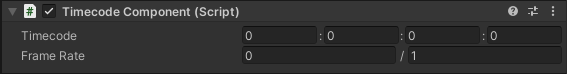

# Timecode Component

The Timecode component stores animatable bindings of a timecode and a frame-rate. Use this component to visualize and animate a timecode and a frame-rate in the editor.

## Properties

| **Property** | **Function** |
|:---|:---|
| **Timecode** | The timecode stored in the component. |
| **Frame Rate** | The frame rate stored in the component. |