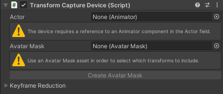

# Transform Capture Device component

Use the Transform Capture Device component to capture in real time the transform hierarchy under an Animator component in the Scene. You can optionally use an Avatar Mask to select the specific transforms to capture.

## Bindings

| **Property** | **Description** |
|:---|:---|
| **Actor** | The target Animator Actor to record. |
| **Avatar Mask** | The Avatar Mask asset containing the list of active transforms to use. This property is optional. |
| **Create Avatar Mask** | Allows you to create an Avatar Mask asset from the targeted **Actor**. |

## Keyframe Reduction

Allows you to adjust the level of keyframe reduction applied to your recordings. Higher values produce smaller files but might affect the recorded animation curve accuracy.

| **Property** | **Description** |
|:---|:---|
| **Position Error** | The relative tolerance (in percent) for reducing position keyframes. |
| **Rotation Error** | The tolerance (in degrees) for reducing rotation keyframes. |