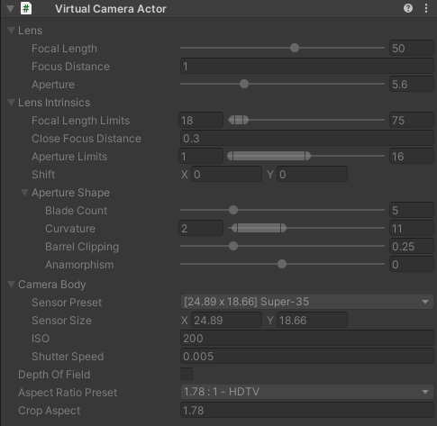

# Virtual Camera Actor component

The Virtual Camera Actor is a component that stores camera properties. These properties are animated through animation clips, or the [Virtual Camera Device](ref-component-virtual-camera-device.md) when the Take Recorder is in Live mode.

The camera drivers (namely, the [Physical Camera Driver](ref-component-physical-camera-driver.md) or [Cinemachine Camera Driver](ref-component-cinemachine-camera-driver.md)) use this component to set the values to the final Camera component.

This component is only editable when not being actively controlled via the Virtual Camera Device.
