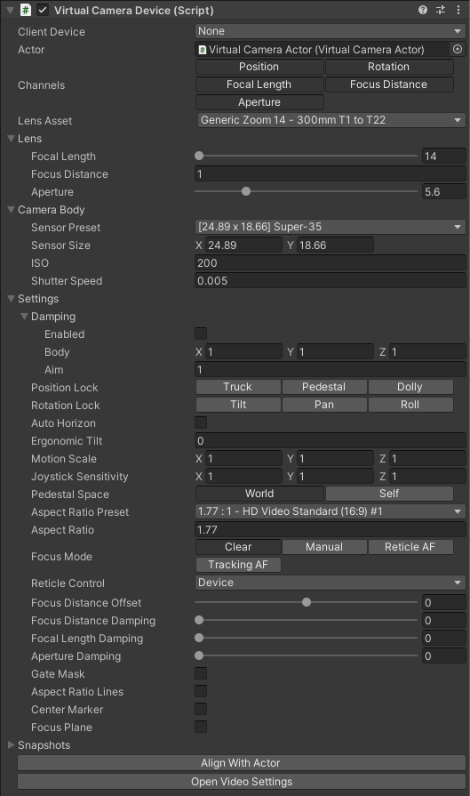
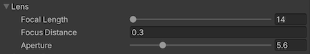
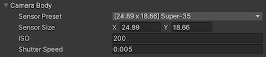
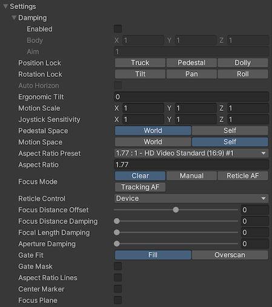
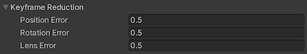
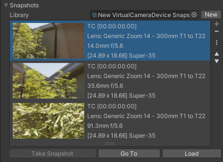

# Virtual Camera Device component

The Virtual Camera Device is a Live Capture Device that records and applies, in real time, camera properties from a connected Client Device to a [Virtual Camera Actor](ref-component-virtual-camera-actor.md).

The Virtual Camera Device communicates with a specific connected Client Device (Virtual Camera app installed on a physical mobile device) in order to retrieve the camera properties. At the same time, the Virtual Camera Device emits a low latency video stream, rendering the driven camera in the Virtual Camera app.

## Bindings

| **Property** | **Description** |
|:---|:---|
| **Client Device** | The connected Client Device to use. The selection list reflects the list of Clients that are currently connected to the Server in the [Connections window](ref-window-connections.md). |
| **Actor** | The target Camera Actor to animate. |

## Channels

This section allows you to control which channels to activate or deactivate for recording when the Take Recorder is in Live mode.

Each channel represents a camera property that you might want to preview and record separately from the others during the recording of a take:
* **Position**
* **Rotation**
* **Focal Length**
* **Focus Distance**
* **Aperture**

## Lens Asset

Select the current lens from an available **[Lens Kit](ref-asset-lens-kit.md)**.

## Open Video settings

This button opens the [Video Server Settings](ref-user-preferences-video-server.md) section of the Unity project Preferences windows.

## Lens

| **Property** | **Description** |
|:---|:---|
| **Focal Length** | The focal length of the lens in millimeters. |
| **Focus Distance** | The focus distance of the lens in world units. |
| **Aperture** | The aperture of the lens in f-number. |

## Camera Body

| **Property** | **Description** |
|:---|:---|
| **Sensor Preset** | Set the values stored in one of the available **[Sensor Presets](ref-asset-sensor-presets.md)**. |
| **Sensor Size** | The size of the camera sensor in millimeters. |
| **ISO** | Set the sensibility of the real-world camera sensor. Higher values increase the Camera's sensitivity to light and result in faster exposure times. |
| **Shutter Speed** | Sets the exposure time in seconds for the camera. Lower values result in less exposed pictures. |

## Settings

Controls the overall behavior of the camera motion and other functions. These properties are shared with the connected client device.

| **Property** | **Description** |
|:---|:---|
| **Damping** | Enable or disable damping effect. • The **Body** of the damping represents how long it takes, in seconds, to reach the target position. You can set it separately for all three directions • The **Aim** is the same as the body but for the rotation. You can set it once for all three rotations.|
| **Position Lock** | Use these toggle buttons to separately lock the position along all three axes. The position lock is relative to the origin. |
| **Rotation Lock** | Use these toggle buttons to separately lock the rotation around all three axes. The rotation lock is relative to the origin. |
| **Auto Horizon** | Enable this option to force the roll rotation to be zero. This is only active when the **Rotation Lock** is enabled, preventing any roll (rotation around the z-axis). |
| **Ergonomic Tilt** | Offsets the tilt, or camera rotation on the x-axis. This helps you manipulate the Client Device in a more comfortable way. This property is only applied when the client is connected. |
| **Motion Scale** | Applies a scale to the device motion when you control the Virtual Camera position. A scale of (1,1,1) means that the Virtual Camera movement matches the device position in the real world. This is useful if the virtual world is bigger than the physical room space you are using. |
| **Joystick Sensitivity** | Sets the camera motion speed obtained when you use the joysticks. A speed of (1,2,1) moves the pedestal axis two time faster. |
| **Pedestal Space** | Sets the pedestal joystick motion to be relative to the Origin or to the Local pose. |
| **Aspect Ratio Preset** | Set a camera aspect ratio from a preset defined in a **[Aspect Ratio Preset](ref-asset-aspect-ratio-presets.md)**. |
| **Aspect Ratio** | The aspect ratio is that is represented via frame lines and optional fill on the **[Frame Lines](ref-component-frame-lines.md)** component. |
| **Focus Mode** | Disables the focus mode or sets it to Manual, Reticle AF, or Tracking AF. |
| **Reticle Control** | Allows you to control the focus reticle from the mobile Device, or from the Game view as well as from the mobile Device (not mutually exclusive). |
| **Focus Distance Offset**   | Offset applied to the focus distance when using either of the autofocus (AF) modes. |
| **Focus Distance Damping**   | Damping applied to the focus distance. |
| **Focal Length Damping**   | Damping applied to the focal length. |
| **Aperture Damping**   | Damping applied to the Aperture (f-number). |
| **Gate Fit**\* | Select a mode to fit the resolution gate relative to the film gate. • **Fill**: The film gate optimally fills the whole resolution gate area. This crops the film gate. • **Overscan**: The resolution gate includes the whole film gate area. This overscans the area outside of the film gate.  |
| **Gate Mask**\*   | Displays a mask outside the boundaries of the film gate. |
| **Aspect Ratio Lines**\*   | Displays aspect ratio lines and mask in the Game view according to the specified Aspect Ratio. |
| **Center Marker**\*   | Displays a center marker in Game view. |
| **Focus Plane**   | Renders a visualization of the focus plane. This option is directly controlling the activation status of the [Focus Plane component](ref-component-focus-plane-renderer.md) associated to the [Virtual Camera Actor](ref-component-virtual-camera-actor.md). |

\* These four options are directly controlling properties of the [Frame Lines component](ref-component-frame-lines.md) associated to the [Virtual Camera Actor](ref-component-virtual-camera-actor.md).

## Keyframe Reduction

Allows you to adjust the level of keyframe reduction applied to your recordings. Higher values produce smaller files but might affect the recorded animation curve accuracy.

| **Property** | **Description** |
|:---|:---|
| **Position Error** | The relative tolerance (in percent) for reducing position keyframes. |
| **Rotation Error** | The tolerance (in degrees) for reducing rotation keyframes. |
| **Lens Error** | The relative tolerance (in percent) for reducing lens keyframes. |

## Snapshots

Use Snapshots to capture the current state of your Virtual Camera and reuse it later.

>**See also:**
>* [Using Virtual Camera Snapshots](virtual-camera-snapshots.md).
>* [Project Settings: Snapshots](ref-project-settings-snapshots.md)

### Library

| Property/button | Function |
| :--- | :--- |
| **Library** | The asset file containing the Snapshots currently listed. |
| **New** | Allows you to create another asset file if you need to store your Snapshots in multiple assets. |

### Snapshot list

The list displays all Snapshots already taken. Each snapshot entry shows a thumbnail of the camera view, along with metadata like the shot name, timecode, lens information, and sensor size.

Use the controls at the right of the list to search and manage Snapshots.

| Control | Function |
| :--- | :--- |
| Minus ( **-** ) button | Deletes the current selected Snapshot |
| Menu ( **⋮** ) button | Allows you to display a text search field at the top of the list to search Snapshots according to their slate metadata, if any. |
| Up/down arrows | Scroll the list up and down. |

### Snapshot controls

Use the buttons under the list to take and reuse Snapshots.

| Button | Function |
| :--- | :--- |
| **Take Snapshot** | Captures a snapshot with the current camera position and metadata. |
| **Go To** | Restores the camera's position and rotation of the selected snapshot and the Timeline's shot if available, without loading the camera related metadata. |
| **Load** | Restores the camera's position, rotation, lens and body of the selected snapshot, and the Timeline's shot if available. |
