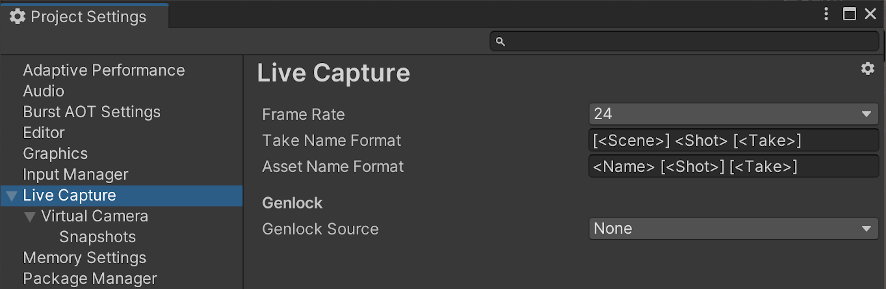

# Project Settings: Live Capture

To access the Live Capture Project Settings, from the Unity Editor main menu, select **Edit > Project Settings**, and then select **Live Capture**.

| **Property**          | **Function**                                                              |
|:----------------------|:--------------------------------------------------------------------------|
| __Frame Rate__        | The frame rate of the project. Controls the frame rate of recorded takes. |
| __Take Name Format__  | The format of the Take System take naming.                                |
| __Asset Name Format__ | The format of the asset names.                                            |

### Genlock

| **Property**          | **Function**                                                        |
|:----------------------|:--------------------------------------------------------------------|
| __Genlock Source__    | The genlock signal source used to control the engine update timing. |
