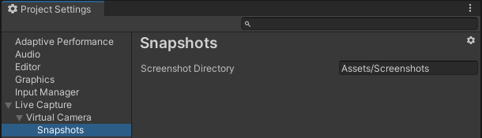

# Project Settings: Snapshots

To access the Snapshots section of the Project Settings, from the Unity Editor main menu, select **Edit > Project Settings**, and then select **Live Capture > Virtual Camera > Snaphots**.

| **Property** | **Function** |
| :--- | :--- |
| **Screenshot Directory** | The path of the folder to store the screenshots displayed in [Snapshots](virtual-camera-snapshots.md). |
