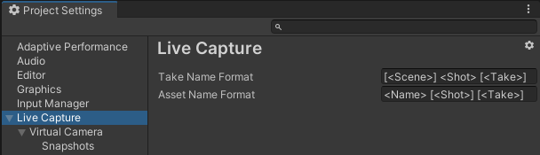

# Project Settings: Take System

To access the Live Capture Project Settings, from the Unity Editor main menu, select **Edit > Project Settings**, and then select **Live Capture**.

### Take System naming

| **Property**           | **Function**                                                 |
| :--------------------- | :----------------------------------------------------------- |
| __Take Name Format__   | The format of the Take System take naming.                   |
| __Asset Name Format__  | The format of the asset names.               |
