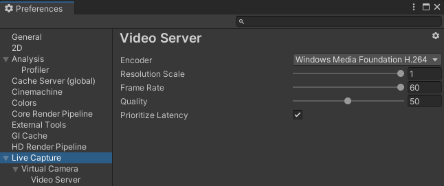

# User Preferences: Video Server

To access the Live Capture Preferences, from the Unity Editor main menu, select **Edit > Preferences**, and then in the Preferences window, select **Live Capture**.

The **Live Capture > Virtual Camera > Video Server** section allows you to configure video streaming properties for Live Capture.

| **Property**             | **Function**                                                 |
| :----------------------- | :----------------------------------------------------------- |
| __Encoder__              | The preferred video encoder to use for video streaming. See the list of [supported encoders](#supported-encoders). If the selected encoder is not available, Unity shows a message to explain why and uses the platform's default encoder instead. |
| __Resolution Scale__     | The resolution of the video stream relative to the source camera resolution. Using a smaller resolution can decrease latency and improve networking performance. |
| __Frame Rate__           | The frame rate of the video stream. Ideally, to minimize latency, you should ensure to make it match the refresh rate of the devices you are using to view the video stream. |
| __Quality__              | The bit rate of the video stream. Using a lower quality can improve networking efficiency. |
| __Prioritize Latency__   | Enable this option to attempt to minimize the latency at the cost of performance. Disable it if you are experiencing frame rate issues. |

### Supported Encoders

| **Encoder**                         | **Supported Platform**  | **Description**                                                    |
| :---------------------------------- | :----------------------- | :----------------------------------------------------------- |
| __Windows Media Foundation H.264__  | Windows                  | The default video encoder for Windows. |
| __NVENC H.264__                     | Windows                  | The video encoder provided by Nvidia graphics cards. This encoder option typically provides better performance than the default encoder. |
| __Video Toolbox H.264__             | macOS                   | The default video encoder for Mac OS. |

### Advanced video streaming

The video servers use the RTSP protocol to transport the video stream. Thus, you can connect any RTSP client to the video streaming server.
