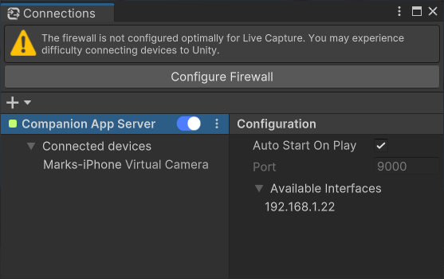

# Connections window

The Connections window allows you to manage local network and connection settings to allow you to connect client apps with the Unity Editor.

To open this window, from the Unity Editor main menu, select **Window** > **Connections**.

### Configure Firewall

Use the **Configure Firewall** button to automatically set up a dedicated inbound rule in your firewall so that you can connect apps from your local network with the current version of the Unity Editor you're using.

>**Note:**
>* This feature is only available on Windows.
>* The button appears only if the Unity Editor detects that your firewall is not optimally configured for Live Capture.

See [how to setup your network on Windows](setup-network.md) if you encounter connection issues.

### Companion App Server

| Button/Property | Function |
|:---|:---|
| **Start/Stop** | Starts the server to enable the connection of client apps with the Unity Editor, or stops it when it is already started. |
| **⋮** | Allows you to remove the server if you need to. |
| **Auto Start On Play** | Enable this option to automatically start the server when you enter the Play mode. |
| **Port** | The server port number to use for the connection. You can specify a different port number if you are already using the default one (9000) for other purposes. |

### Available Interfaces

The Available Interfaces section displays the list of all available IP addresses that correspond to the server on your network. You might need to specify one of these IP addresses in the client application interface if you need to perform a manual connection.

>**Note:** Some of the displayed IP addresses might actually not allow you to connect the apps to the server.

### Connected Clients

The Connected Clients section displays the list of all client apps that are currently connected to the server.

### Create Connection

Use the **Create Connection** button and select **Companion App Server** to create a server if the Connections window doesn't display any server properties.

>**Note:** You cannot create several Companion App Servers.
