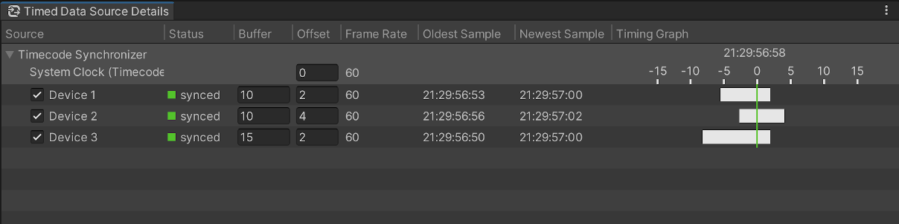

# Timed Data Source Details window

Use the Timed Data Source Details window to manage synchronized data sources.

To open this window, from the Unity Editor main menu, select **Window** > **Live Capture** > **Timed Data Source Details**.

The table shows all timecode synchronizers and the data sources assigned to each.

### Timecode synchronizer properties

| Property           | Description                                                                                                                                                                                                                                                                                                                             |
|:-------------------|:----------------------------------------------------------------------------------------------------------------------------------------------------------------------------------------------------------------------------------------------------------------------------------------------------------------------------------------|
| **Source**         | The name of the timecode synchronizer.  When expanded, the timecode source assigned to the synchronizer is shown beneath the name.                                                                                                                                                                                              |
| **Offset**         | The delay (in frames) applied to the source timecode. Use a positive value to compensate for high-latency data sources.                                                                                                                                                                                                                 |
| **Frame Rate**     | The frame rate of the timecode source assigned to the synchronizer.                                                                                                                                                                                                                                                                     |
| **Timing Graph**   | The timecode that data sources will synchronize to.  When expanded, the axis for the timing graph is shown beneath the timecode. The axis is labelled in frames relative to the timecode.                                                                                                                                       |

### Data source properties

| Property          | Description                                                                                                                                                                                                                                                                                                                                                                                   |
|:------------------|:----------------------------------------------------------------------------------------------------------------------------------------------------------------------------------------------------------------------------------------------------------------------------------------------------------------------------------------------------------------------------------------------|
| **Source**        | The name of the data source.  The checkbox controls whether the data source is synchronized.                                                                                                                                                                                                                                                                                          |
| **Status**        | The current synchronization status of the data source. • **synced** (green): The data source is synchronized. • **behind** (yellow): The buffered data is too old (i.e. latency is too high). • **ahead** (yellow): The buffered data is too new (i.e. synchronization updates are happening too late, buffer is too small). • **no data** (gray): There is no buffered data. |
| **Buffer**        | The number of data frames to buffer for this data source. Adjust the value to get a consistent overlap between the synchronized data sources.                                                                                                                                                                                                                                                 |
| **Offset**        | The time offset applied to sample timecodes, in frames. This value should typically match the time delay between timecode generation and data sampling for a single frame.                                                                                                                                                                                                                    |
| **Frame Rate**    | The frame rate of the data source.                                                                                                                                                                                                                                                                                                                                                            |
| **Oldest Sample** | The timecode of the oldest sample in the buffered data.                                                                                                                                                                                                                                                                                                                                       |
| **Newest Sample** | The timecode of the newest sample in the buffered data.                                                                                                                                                                                                                                                                                                                                       |
| **Timing Graph**  | Visualizes the timecodes of the buffered data relative to the synchronization timecode. When well calibrated, the white bar representing the buffered data should comfortably overlap the line in the middle. Scroll here to zoom in or out as desired.                                                                                                                                       |
