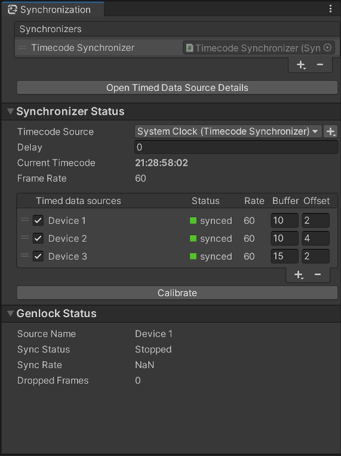

# Synchronization window

Use the Synchronization window to manage timecode synchronizers and monitor the genlock status.

To open this window, from the Unity Editor main menu, select **Window** > **Live Capture** > **Synchronization**.

## Synchronizer list

| Control       | Function                                                  |
|:--------------|:----------------------------------------------------------|
| Handle        | Use the handles at the left to manually reorder the list. |
| **+** (plus)  | Add a timecode synchronizer to the active scene.          |
| **-** (minus) | Remove the selected timecode synchronizer from the scene. |

## Data Source Details shortcut

Use the **Open Timed Data Source Details** button to open the [Timed Data Source Details Window](ref-window-data-source-details.md).

## Synchronizer Status

Select a timecode synchronizer in the above synchronizer list to view its details here. 

See the [Timecode Synchronizer](ref-component-timecode-synchronizer.md) component reference for an overview of synchronizer controls.

## Genlock Status

This section is used to monitor the genlock status of the engine.

| Control            | Function                                                                                                                                                                                                                                         |
|:-------------------|:-------------------------------------------------------------------------------------------------------------------------------------------------------------------------------------------------------------------------------------------------|
| **Source Name**    | The name of the genlock source.                                                                                                                                                                                                                  |
| **Sync Status**    | The status of the genlock source. • **Stopped**: The genlock source is not running. • **Synchronized**: The genlock source is synchronizing the engine. • **Not Synchronized**: The genlock source failed to synchronize the engine. |
| **Sync Rate**      | The pulse rate of the synchronization signal.                                                                                                                                                                                                    |
| **Dropped Frames** | The total number of synchronization pulses missed.                                                                                                                                                                                               |
