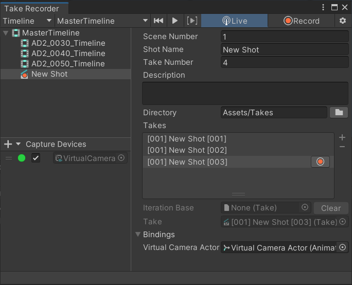

# Take Recorder

Use the Take Recorder window to manage your capture devices, browse through your shots, and record and play back takes.

To open this window, from the Unity Editor main menu, select **Window** > **Live Capture** > **Take Recorder**.

## Shot browser

Use the top left pane of the Take Recorder window to select shots from a Timeline or a [Shot Library](ref-asset-shot-library.md), in order to edit their properties and record or play back takes.

### Properties

Use the right pane to inspect and edit the properties of the selected shot.

| Property | Description |
|:---|:---|
| **Scene Number** | The number of the cinematic scene for which you record the shots. |
| **Shot Name** | The name of the shot. |
| **Take Number** | The take index of the shot. |
| **Description** | The description of the shot. |
| **Directory** | The project folder to save the recorded takes to. To change the path, type in the field or use the folder button at the right. |
| **Takes** | The list of recorded takes currently available in the directory. |
| **Iteration Base** | The take to play and iterate on in a recording session. • To set this property, select in the Take list the take to iterate on and click on the red button at its right. • To clear this property when you want to record a new take without iterating on an existing one, use the **Clear** button at the right of the field. |
| **Take** | The current take selected in the **Takes** list. |
| **Bindings** | The list of referenced GameObjects that the selected take uses. |

### Recording and playback

Use the controls at the toolbar to record and play back takes of the selected shot.

| Control/property | Description |
|:---|:---|
| **Go To Beginning** | Moves the playhead to the start time of the selected shot. If **Play Contents Range** is enabled, it moves the playhead to the beginning of the contents of the selected shot. |
| **Play/Pause** | Starts and stops playing back a take according to the current connected apps. |
| **Play Contents Range** | When enabled, instructs the Take Recorder to play only the range of the selected shot that includes contents from a take. A take can start after the beginning of a shot and end before its end. |
| **Live** | Sets the Take Recorder in Live mode, which allows you to capture and record takes through connected apps. |
| **Start/Stop Recording** | Starts and stops the recording of a take according to the current connected apps. This button is only available when you set the Take Recorder in Live mode and at least one client is connected. |
| **Settings** | Opens the Live Capture section of the Project Settings window, where you can configure the recording frame rate, among others. |

## Capture Devices

Use the bottom left pane of the Take Recorder window to add and manage capture devices to use for a take recording session.

| Control/property | Description |
|  :--- |  :--- |
| **+** (plus) button | Adds a capture device to the list, according to the available capture device types. **Note:** To be able to use the added capture device, you must edit its properties through the right pane to at least bind it to a connected Client Device and to an Actor in the Scene. |
| Red/green icon | The current connection status of the client device linked to the capture device. |
| Checkbox | Makes the capture device participate or not in a recording session. |
| Target field | Select this field to locate the capture device in the Hierarchy. |

### Properties

Use the right pane to inspect and edit the properties of the selected capture device.

Each capture device type has its own set of properties:
* [Virtual Camera Device properties](ref-component-virtual-camera-device.md)
* [ARKit Face Device properties](ref-component-arkit-face-device.md)
* [Transform Capture Device properties](ref-component-transform-capture-device.md)
