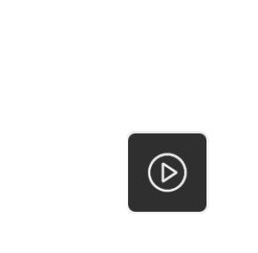

# Recording and reviewing performances

Ensure that you have set up and understand the [Take System](take-system.md) before proceeding.

## Recording a performance

After connecting to the companion app:
* Press the **Record** button in the companion app (above the right sidebar) or press the **Record** button in the **Take Recorder** component in the editor.
* When you stop recording, the **Take** asset will be saved inside the folder set in the current **Slate**.

## Reviewing a recorded performance

After recording a Take, tap the button in the bottom right to enter the **Playback** mode.

In this mode there are several options:

* Press **Play** to play the performance back on the device.
* Press the **Timeline** button in the bottom left to open a playback radial slider to scrub through the performance.
