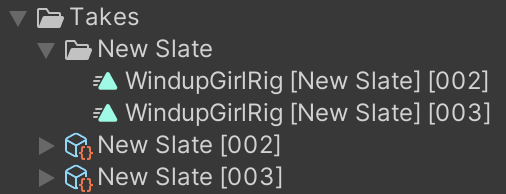

# Using the Take System

## Setting up your scene

1. If one doesn't exist, create a [Take Recorder](ref-component-take-recorder.md) by going to **GameObject > Live Capture > Take Recorder** in the menu bar or by right clicking in the Hierarchy panel and selecting **Live Capture > Take Recorder**.
2. Create or select a Director component in your scene to open the Timeline window and add a **Take Recorder Track** by right-clicking the track panel and selecting **Unity.LiveCapture > Take Recorder Track**.
3. Assign the **Take Recorder** in your scene to the **Take Recorder Track**.

## Recording a take

See [how to record a take from the apps](take-system-recording.md).

The following is an example of the file structure of the recorded takes in Assets.

## Reviewing a previously recorded take

1. Open an unlocked Timeline window.
2. Select the **Take Recorder** game object.
3. Select an available **Take** from the list in the **Take Recorder** Inspector.
4. Make sure the **Take Recorder** is in **Playback** mode instead of **Live**. Disable **Live** mode by clicking the **Playback** button in the **Take Recorder** component.
5. Press the **Play** button in the Timeline or scrub the playhead.
6. Press the **Live** button on the **Take Recorder** when you're ready to record again.

## Iterative recording

Iterative recording consists in recording layered takes over several iterations. Each iteration is a duplicate of the take set as iteration base, where Animation Track overrides are added to the base tracks.

For example, when using the Virtual Camera, you may want to capture just the position and rotation of the camera, and do focus pulling in a separate take to tune the Depth of Field.

### Set a Take as the Iteration Base

* Select a take from the `Takes` list in the **Take Recorder** component and click on the button with the record icon.

### Clear the iteration base

* Click the `Clear` button next to the `Iteration Base` field.

### Multi-pass recording

Multi-pass recording allows you to select a different parameter or data `Channel` to record.

1. Select the **Virtual Camera Device** component.
2. Toggle off the `Channels` that should not be captured in the next recording.
3. Press the **Record** button and redo the active Channels.
