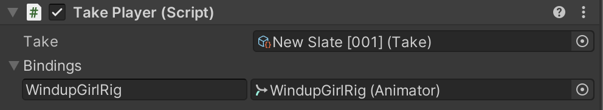

# Using the Take System

## Components

### Take Recorder

| Field             | Description                                 |
| ----------------- | ------------------------------------------- |
| Capture Devices   | Toggle the devices on or off in order to make them participate in a recording session. |
| Take Name Format  | The format of the name of the produced take asset. |
| Asset Name Format | The format of the name of the assets that the capture devices produce, like the animation clips. |

### Slate Database

| Field          | Description |
| -------------- | ----------- |
| Shot Name      | The name of the shot. |
| Take Number    | The take index of the shot. |
| Directory      | The path where the takes are stored. |
| Takes          | The takes available in the directory. |
| Iteration Base | The take to play and iterate in a recording session. |

The following is an example of the file structure of the recorded takes in Assets.

### Take Player

The **Take Player** is responsible for playing a recorded take. It is most commonly used in conjunction with the **Slate Database** but functions independently as well. If used independently, the **Take** and **Bindings** must be manually assigned.

| Field    | Description                                                  |
| -------- | ------------------------------------------------------------ |
| Take     | The current take to review in the **Timeline**.              |
| Bindings | Bindings are set up automatically when the **Take Player** is on the same Game Object as the **Slate Database**. The binding format is [ <Actor name>**Animator** reference ]. |

## Setting up your scene

1. If one doesn't exist, create a Take Recorder by going to **GameObject > Live Capture > Take Recorder** in the menu bar or by right clicking in the Hierarchy panel and selecting **Live Capture > Take Recorder**.
2. Create or select a Director component in your scene to open the Timeline window and add a **Slate Track** by right-clicking the track panel and selecting **Unity.LiveCapture > Slate Track**.
3. Assign the **Take Recorder** in your scene to the **Slate Track**.

## Reviewing a previously recorded performance

1. Open an unlocked Timeline window.
2. Select the **Take Recorder** game object.
3. Select an available **Take** from the list in the **Slate Database** Inspector.
4. Make sure the **Virtual Camera Device** is in **Preview** mode instead of **Live**. Disable **Live** mode by clicking the **Preview** button in the **Take Recorder** component.
5. Press the **Play** button in the Timeline or scrub the playhead.
6. Press the **Live** button on the **Take Recorder** when you're ready to record again.

## Iterative recording

Iterative recording consists in recording layered Takes over several iterations. Each iteration allows you to add or modify tracks from a Take set as the iteration base.

For example, when using the Virtual Camera, you may want to capture just the position and rotation of the camera, and do focus pulling in a separate take to tune the Depth of Field.

### Set a Take as the Iteration Base

* Select a Take from the `Takes` list in the **Slate Database** component and click on the button with the record icon.
  OR
* Set a Take in the `Iteration Base` field.

### Clear the iteration base

* Click the `Clear` button next to the `Iteration Base` field
  OR
* Set the `Iteration Base` field to `None (Take)`.

### Multi-pass recording

Multi-pass recording allows you to select a different parameter or data `Channel` to record. The new clip inherits the curves from the clip available in the iteration base for the disabled Channels.

1. Select the **Virtual Camera Device** component.
2. Toggle off the `Channels` that should not be captured in the next recording.
3. Press the **Record** button and redo the active Channels.