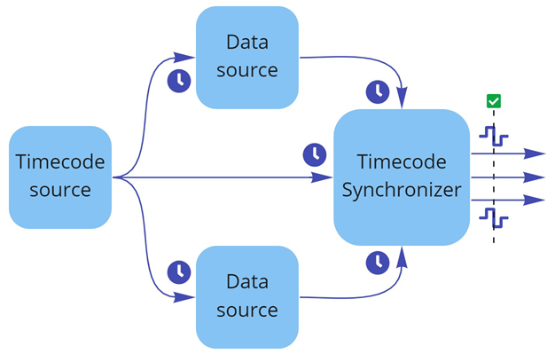

# Timecode synchronization

The Live Capture package includes features that allow you to temporally synchronize all compatible Live Capture devices connected to the Unity Editor according to a centralized timecode source.

## Main use cases

**Takes with multiple devices:** If you record takes that simultaneously involve multiple capture devices, you might need to mark the start of the recording for each device with a reliable timecode to ensure all recordings can be correctly aligned and effectively synchronized when replayed using Timeline or exported to a third party software.

**Live scenarios:** If you use the Unity Editor for real-time output, you need to synchronize all external inputs via a timecode provided with each input sample, so that each frame output by the engine is temporally coherent.

## Overall concept

Live Capture's timecode synchronization overall structure conceptually relies on three main types of interconnected elements:
* Data sources
* Timecode source
* Timecode Synchronizer

The data sources are [Live Capture compatible devices](#supported-data-sources) connected to the Unity Editor for data transmission purposes. For example, the Unity Virtual Camera and Unity Face Capture apps installed on mobile devices are data sources.

The timecode source is typically [a device or a chain of devices](#supported-timecode-sources) connected with the Unity Editor and all data sources to provide them a centralized timecode for further synchronization. For example, the timecode source can be a timecode generator such as Tentacle Sync, an audio device transmitting a Linear Time Code (LTC), or a combination of both.

The Timecode Synchronizer is [a tool in the Unity Editor](#timecode-synchronizer-structure) that processes and compares all timecodes received via the data sources with the one directly received from the timecode source. The Timecode Synchronizer provides the synchronization status of each data source in real time, and allows to adjust the necessary parameters to get a perfect synchronization of all data sources.

## Supported data sources

* Any [supported mobile device](index.md#install-app) with Bluetooth enabled and one of the Live Capture companion apps installed:
  * [Unity Virtual Camera](virtual-camera.md)
  * [Unity Face Capture](face-capture.md)

## Supported timecode sources

The Live Capture package and companion apps currently support a limited set of timecode source hardware:

* The Unity Virtual Camera and Unity Face Capture apps only support the [Tentacle Sync](https://tentaclesync.com/sync-e) timecode generator.
* The Timecode Synchronizer in Unity Editor supports [Linear Time Code (LTC)](https://en.wikipedia.org/wiki/Linear_timecode) and [Network Time Protocol (NTP)](https://en.wikipedia.org/wiki/Network_Time_Protocol) as timecode input.

**Note:** Tentacle Sync devices usually support LTC input, which allows you to get a functional [timecode synchronization setup](timecode-synchronization-getting-started.md) despite these current limitations.

Additionally, the Live Capture package provides a means to use the Unity Editor workstation system clock as the timecode source. However, you should only use it for testing purposes, as it might provide inaccurate results if you use it for synchronization purposes.

## Timecode Synchronizer structure

In the Unity Editor, a Timecode Synchronizer typically consists of a GameObject with:
* A [Timecode Synchronizer component](ref-component-timecode-synchronizer.md)
* A Timecode source component from the available ones:
  * [LTC Timecode Source](ref-component-ltc-timecode-source.md)
  * [NTP Timecode Source](ref-component-ntp-timecode-source.md)
  * [System Clock Timecode Source](ref-component-system-clock-timecode-source.md)
