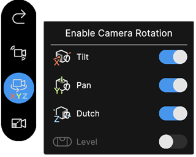
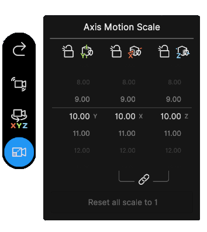
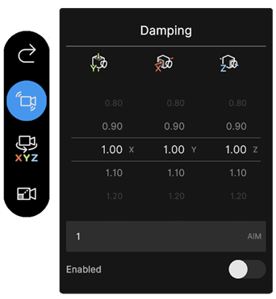
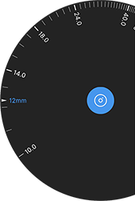
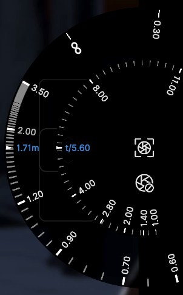
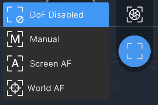
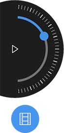
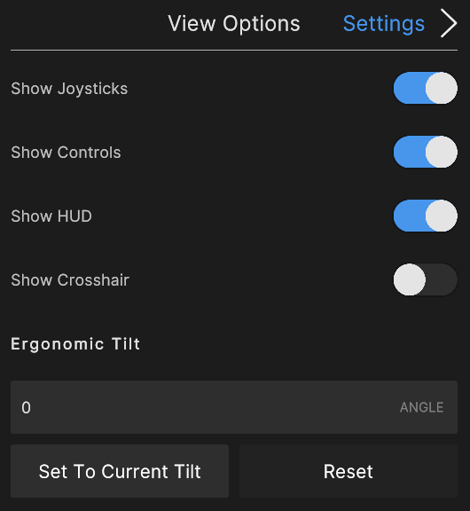
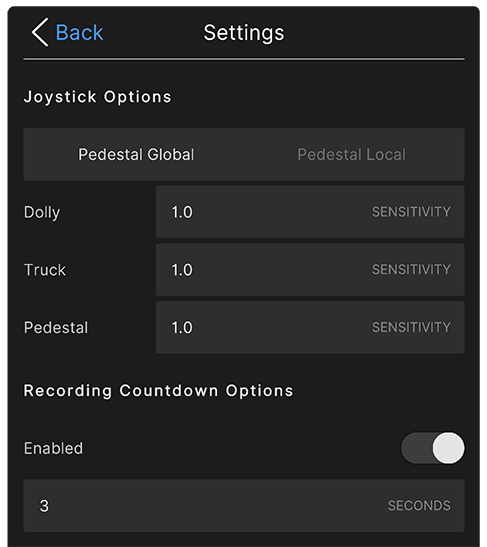

# Virtual Camera controls and settings

## Controls

### HUD

| **Field**              | **Function**                                                 |
| :--------------------- | :----------------------------------------------------------- |
| __Settings__           | Opens the [settings window](#settings) to configure view options, joystick settings, recording options, etc. |
| __Timeline__           | Shows whether or not a timeline is assigned in the **Live Capture** window. |
| __SENSOR__               | Displays the current sensor size in millimeters.                       |
| __TIME__           | Displays the timecode (hr:min:sec:frame) of the current recording session or clip. |
| __FOCUS MODE__         | Displays the current [focus mode](#focus-mode). |
| __FOCUS DIST__     | Displays the current focus distance in meters. This displays "N/A" when you select the "Clear" [focus mode](#focus-mode). |
| __F-STOP__           | Displays the current [aperture](#focus-and-aperture-dials) (f-number).                       |
| __ZOOM__       | Displays the current [focal length](#focal-length) (zoom) in millimeters.              |
| __AR Tracking__ | Tap to enable/disable AR tracking.                            |
| __Connection__         | Tap to open a connection window to connect or disconnect from a server. |
| __Help__               | Tap to enter Help Mode. In Help Mode, tap any control to display a tooltip with more information about its functionality. |

### Axis rotation locking

Use the switches to lock or unlock rotation about each of the three axes (**Tilt**, **Pan**, **Roll**). This can be useful to simulate certain types of camera movement.

### Motion Scale and axis position locking

You can change the motion scale to multiply the tracked motion along a given local axis. This can be useful if there is limited physical space, or to simulate the motion from a crane or a drone.

You can also select the lock icon beside each axis icon to lock or unlock the position along this axis. For example, to simulate a tripod, lock all three axes.

### Damping Settings

You can apply positional and rotational damping to the camera motion from your mobile device as well as from the server (in the Unity Editor).

| **Field**          | **Function**                                                 |
| :----------------- | :----------------------------------------------------------- |
| __Body__           | Time in seconds for the rig to reach the target position. You can set a different value on each axis. |
| __Aim__            | Time in seconds for the rig to reach the target rotation. The value you set applies to all three axes. |
| __Enabled__ | Enables or disables positional and rotational damping on all axes. |

**When you use a Cinemachine Camera Actor, the damping only applies in Play Mode.**

### Reset Pose and Lens

Pressing the **Reset Pose** button repositions the camera rig to its origin. This has no impact on the rotation of the camera.

Pressing the **Reset Lens** button resets the camera lens to its default settings.

### Focal Length

Change the focal length of the camera using focal length dial. Open the dial with the focal length button on the right control bar. Rotate the dial to change the value. The current focal length is displayed in the HUD under **ZOOM**.

Changing the focal length sets the distance, in millimeters, between the camera sensor and the camera lens. Lower values result in a wider Field of View, and vice versa.

### Focus and aperture dials

The focus and aperture dials allow you to manually set the camera focus distance and aperture.

To display the focus and aperture dials, press the middle icon in the app screen's right vertical toolbar.

| Dial display in manual mode | Dial display in autofocus (AF) modes |
|:---|:---|
|  |  |

| Dial | Description |
|:---|:---|
| Center | The aperture dial. It allows you to manually set the camera aperture in f-number. Its graduated scale shows the standard f-stop values for reference. |
| Outer | The focus dial. Its function depends on the selected [focus mode](#focus-mode): • In manual mode, this dial allows you to manually set the camera focus distance in meters. • In any of the two autofocus (AF) modes, this dial allows you to apply an offset to the automatically evaluated focus distance. |

### Focus mode

The focus mode defines how you want to control the camera focus from the app interface.

To change the camera focus mode, press the bottom icon in the app screen's right vertical toolbar, and select the mode in the list.

| Mode | Description |
|:---|:---|
| __Clear__ | Disables the depth of field (DoF). All elements of the scene appear in focus whatever their distance to the camera.  **Note:** If you use the [focus dial](#focus-and-aperture-dials) from this mode, the mode automatically changes to **Manual**. |
| __Manual__ | Allows you to manually set the camera focus distance in two alternative ways: • Tap the screen to focus on a specific 3D point of the scene. A reticle briefly appears where you tapped the screen, and then disappears. • Use the [focus dial](#focus-and-aperture-dials) to manually set up a focus distance value. |
| __Reticle AF__ | Automatically and constantly focuses the camera at the 3D point of the scene under the displayed reticle. • Tap the screen if you need to change the reticle position. Notice the reticle is persistent in this mode. • Use the [focus dial](#focus-and-aperture-dials) if you need to apply a focus distance offset.  **Note:** This mode is resource intensive, as Unity constantly calculates the focus distance. You might need to lower the quality of the video stream to maintain the desired framerate. |
| __Tracking AF__ | Allows you to automatically and constantly keep the focus on a specific selected element of the scene. • Tap the screen to select the scene element you want to keep the focus on. A reticle briefly appears where you tapped the screen, and then disappears. • Use the [focus dial](#focus-and-aperture-dials) if you need to apply a focus distance offset.  **Note:** To be able to select an object to keep focus on, its mesh must be readable and use at least a material with a pass matching one of the following tags: `Forward`, `ForwardOnly`, `SRPDefaultUnlit`, `GBuffer`, `ForwardLit`, `Unlit`, `UniversalForward`. Built-in SRP and ShaderGraph materials should be covered, remember to tag one of your passes when working with custom shaders. |

**Note:** You might also be able to click in the Unity Editor Game view to set the reticle position depending on the [Virtual Camera Device component](ref-component-virtual-camera-device.md) Reticle Control property value.

 _How the reticle displays on the app screen._

###  Timeline Control

If there is a Timeline assigned to in the **Live Capture** window top control panel, tap the timeline button in the botttom left to bring up a playback control radial slider. Scrub the radial slider to move through the playback.

Pressing record will automatically play the Timeline from the selected head position.

Note the playback progress bar at the top of the screen under the HUD.

## Settings

Open the settings by tapping the **Settings** button in the top left of the HUD.

### View Options

| **Option**              | **Description**                                              |
| :---------------------- | :----------------------------------------------------------- |
| __Show Joysticks__      | Toggles the visibility of the virtual joysticks              |
| __Show Controls__       | Toggles the visibility of the camera controls on the left and right of the screen |
| __Show HUD__            | Toggles the visibility of the HUD bar at the top of the screen. To re-enable, tap the screen with 3 fingers |
| __Show Crosshair__      | Toggles the visibility of a crosshair in the center of the screen to help frame shots |
| __Ergonomic Tilt__      | Tilts the device orientation relative to the virtual camera orientation to allow for a more ergonomic grip |
| __Set To Current Tilt__ | Sets the tilt according to the current orientation of your device. |
| __Reset__               | Resets the tilt to 0.                                        |

### Controls Tab

* Set if the pedestal joystick (the right joystick) moves up in global or local space
* Set the sensitivity of the joystick in each axis
