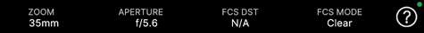

# Virtual Camera information bar

The information bar displays recording/playback indicators about the current take, along with the current values of the main camera properties. It also includes icons to access the app settings and a help mode.

 • • •

• • • 

| Property | Description |
| :--- | :--- |
| **Settings**  | Opens the [app settings window](virtual-camera-app-ui-settings.md). |
| **SHOT** | The name of the shot stored in the current slate. |
| **GATE** | The current gate size (physical camera sensor size) in millimeters. |
| **FRAME** | The current frame number (left) and the total number of frames (right) of the current recording session or clip. |
| **TIME** | The current timecode (hr:min:sec:frame) of the current recording session or clip. |
| **ZOOM** | The current [focal length](virtual-camera-app-ui-lens.md#focal-length) in millimeters. |
| **APERTURE** | The current [aperture](virtual-camera-app-ui-lens.md#focus-and-aperture) in f-number. |
| **FCS DIST** | The current focus distance in meters.  **Note:** Focus distance displays "N/A" when you set the [focus mode](virtual-camera-app-ui-lens.md#focus-mode) to "Clear" (no depth of field). |
| **FCS MODE** | The current [focus mode](virtual-camera-app-ui-lens.md#focus-mode). |
| **Help**  | Tap this icon to enter or exit the app Help Mode. In Help Mode, tap any control to display a tooltip describing its function. |

>**Note:** You can toggle the visibility of the information bar through the [app settings](virtual-camera-app-ui-settings.md#main-view) to toggle the visibility of the information bar. Also, to quickly display the information bar when it is hidden, tap the app main screen with 3 fingers.
