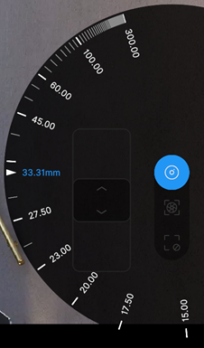
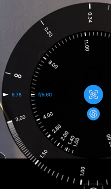
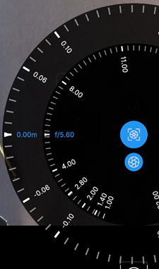
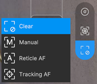
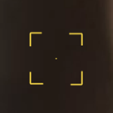

# Virtual Camera lens menu and controls

Use the menu at the right of the app main screen to control the camera lens.

| Menu button | Function |
| :--- | :--- |
| [Focal length](#focal-length) | Change the value of the camera focal length (zoom). |
| [Focus and aperture](#focus-and-aperture) | Manually change the camera focus distance and aperture. |
| [Focus mode](#focus-mode) | Define how you want to control the camera focus from the app interface. |

### Focal length

Use the focal length control wheel to change the value of the camera focal length (zoom).

Rotate the wheel to set the distance, in millimeters, between the camera sensor and the camera lens.  A lower value results in a wider Field of View, and vice versa.

The [information bar](virtual-camera-app-ui-infobar.md) displays the current focal length under **ZOOM**.

### Focus and aperture

Use the focus and aperture control wheels to manually change the camera focus distance or focus distance offset, and the aperture.

| In manual mode | In autofocus (AF) modes |
|:---|:---|
|  |  |
| _Focus distance and aperture_ | _Focus distance offset and aperture_ |

| Wheel | Description |
|:---|:---|
| Center | Rotate this wheel to manually set the camera aperture in f-number. Its graduated scale shows the standard f-stop values for reference.  **Note:** Tap the lower button to hide/display the aperture wheel while keeping the focus wheel displayed. |
| Outer | Rotate this wheel to adjust the camera focus according to the selected [focus mode](#focus-mode):  • When in **Manual** mode, manually set the camera focus distance in meters; OR • When in an **Autofocus (AF)** mode, add an offset to the automatically evaluated focus distance. |

### Focus mode

Use the focus mode options to define how you want to control the camera focus from the app interface.

| Mode | Description |
|:---|:---|
| **Clear** | Disables the depth of field (DoF). All elements of the scene appear in focus regardless of their distance to the camera.  **Note:** If you use the [focus wheel](#focus-and-aperture) from this mode, the mode automatically changes to **Manual**. |
| **Manual** | Allows you to manually set the camera focus distance in two alternative ways: • Tap the screen to focus on a specific 3D point of the scene. A reticle briefly appears where you tapped the screen, and then disappears. • Use the [focus wheel](#focus-and-aperture) to manually set up a focus distance value. |
| **Reticle AF** | Automatically and constantly focuses the camera at the 3D point of the scene under the displayed reticle. • Tap the screen if you need to change the reticle position. Notice the reticle is persistent in this mode. • Use the [focus wheel](#focus-and-aperture) if you need to apply a focus distance offset.  **Note:** This mode is resource intensive, as Unity constantly calculates the focus distance. You might need to lower the quality of the video stream to maintain the desired framerate. |
| **Tracking AF** | Allows you to automatically and constantly keep the focus on a specific selected element of the scene. • Tap the screen to select the scene element you want to keep the focus on. A reticle briefly appears where you tapped the screen, and then disappears. • Use the [focus wheel](#focus-and-aperture) if you need to apply a focus distance offset.  **Note:** To be able to select an object to keep focus on, its mesh must be readable and use a material with a pass matching one of the following tags: `Forward`, `ForwardOnly`, `SRPDefaultUnlit`, `GBuffer`, `ForwardLit`, `Unlit`, `UniversalForward`. Built-in SRP and ShaderGraph materials should be covered, remember to tag one of your passes when working with custom shaders. |

**Note:** You might also be able to click in the Unity Editor Game view to set the reticle position depending on the [Virtual Camera Device component](ref-component-virtual-camera-device.md) Reticle Control property value.

 _Reticle indicating the focus target._
