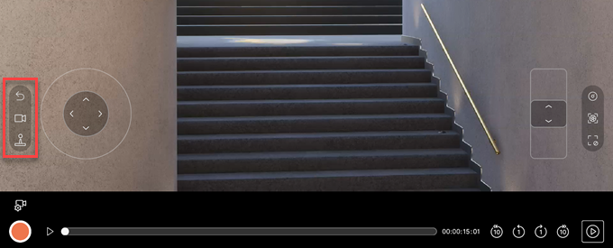
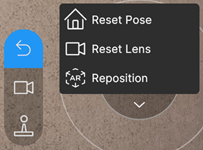
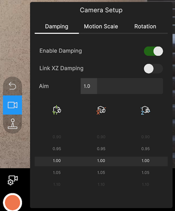
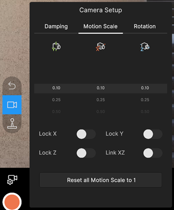
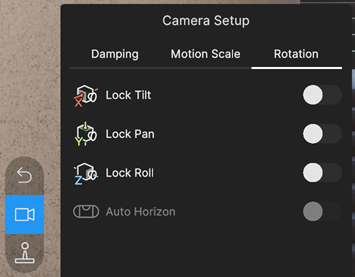
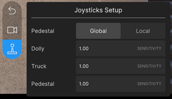

# Virtual Camera motion/reset menu

Use the menu at the left of the app main screen to reset or reposition the camera, or to adjust the camera motion controls and behaviors.

| Menu button | Function |
| :--- | :--- |
| [Reset / Reposition](#reset-and-reposition) | Reset the camera pose or the camera lens properties, or reposition the camera. |
| [Camera Setup](#camera-setup) | Manage the camera motion behavior that results from the movements you apply to the mobile device. |
| [Joysticks Setup](#joysticks-setup) | Adjust the sensibility and translation reference space of the joysticks. |

## Reset and reposition

Use the first menu group to reset or adjust the camera position, or to reset the camera lens.

| Action | Status | Description |
| :--- | :--- | :--- |
| **Reset Pose** |  | Repositions the camera rig to its origin. This has no impact on the rotation of the camera. |
| **Reset Lens** |  | Resets all [camera lens properties](virtual-camera-app-ui-lens.md) to their default settings. |
| **Reposition** |  | Disables or re-enables AR tracking.  |
|  |  | AR tracking enabled. In this mode, the app tracks the movements of the mobile device to apply them in real time to the controlled camera in the Unity Editor, according to the app's [Camera Setup](#camera-setup) properties. |
|  |  | AR tracking disabled. This mode freezes the camera in virtual space, which allows you to reposition the mobile device in real world space. Once you repositioned the mobile device, you must re-enable AR tracking. |

## Camera Setup

Use the Camera Setup properties to manage the camera motion behaviors that result from the movements you apply to the mobile device through AR tracking functionality: [Damping](#damping), [Motion Scale](#motion-scale), and [Rotation](#rotation).

### Damping

Use the Damping properties to smoothen the motion that results from the translations and rotations you apply to the mobile device.

| Property | Description |
| :--- | :--- |
| **Enable Damping** | Enables or disables positional and rotational damping on all axes. |
| **Link XZ Damping** | Binds together the **X** and **Z** scrollers to get a uniform translation damping along the X and Z axes. |
| **Aim** | The time in seconds for the rig to reach the target rotation. The value you set applies to all three axes. |
| **Y**, **X**, and **Z** scrollers | The time in seconds for the rig to reach the target position along the Y, X, and Z axes. |

>**Note:** When you use a Cinemachine Camera Actor, the damping only applies in Play Mode.

### Motion Scale

Use the Motion Scale properties to rescale, lock, or unlock the camera motion that results from the translations you apply to the mobile device.

>**Note:** These properties only apply to the AR tracking functionality of the mobile device. They don't affect the behavior of the camera translation joysticks of the app, which have their own [setup properties](#joysticks-setup).

| Property | Description |
| :--- | :--- |
| **Y**, **X**, and **Z** scrollers | The scaling factor applied to the AR-driven camera translation along the Y, X, and Z axes. |
| **Lock X** | Locks the AR-driven camera translation along the X axis. |
| **Lock Y** | Locks the AR-driven camera translation along the Y axis. |
| **Lock Z** | Locks the AR-driven camera translation along the Z axis. |
| **Link XZ** | Binds together the **X** and **Z** scrollers to get a uniform translation scale along the X and Z axes. |
| **Reset all Motion Scale to 1** | Resets the scaling factors of all axes to 1 (no scaling). |

>**Use case examples:**
>* Increase the motion scale if there is limited physical space around you, or to simulate the motion from a crane or a drone.
>* Lock all three axes to simulate a tripod.

### Rotation

Use the Rotation properties to lock or unlock the camera motion that results from the rotations you apply to the mobile device. This can be useful to simulate certain types of camera movement.

| Field | Description |
| :--- | :--- |
| **X** - **Lock Tilt** | Locks the rotation around the X axis (tilt). |
| **Y** - **Lock Pan** | Locks the rotation around the Y axis (pan). |
| **Z** - **Lock Roll** | Locks the rotation around the Z axis (roll). |
| **Auto Horizon** | Sets the roll to zero to keep the camera horizontal along the Z axis when you enable **Lock Roll**. |

## Joysticks Setup

Use the Joysticks Setup properties to adjust the sensibility of the joysticks, and select the reference space the camera translations occur in (global or local) when you use the joysticks.

| Field | Description |
| :--- | :--- |
| **Pedestal** | The reference space the joystick moves the camera in. • **Global** space translates the rig pedestal relative to the world axis. • **Local** space translates the rig relative to the camera's look direction. |
| **Dolly** | The sensitivity of the left joystick along the Z axis (dolly). |
| **Truck** | The sensitivity of the left joystick along the X axis (truck). |
| **Pedestal** | The sensitivity of the right joystick along the Y axis (pedestal). |
