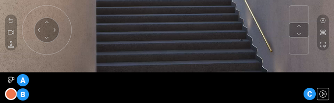
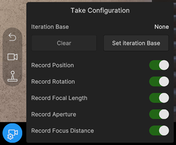
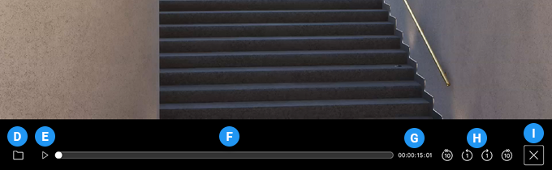
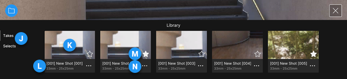

# Virtual Camera recording/playback controls

The Virtual Camera app works in two different modes, which display different interface controls.

| Mode | Purpose |
| :--- | :--- |
| [Live](#live-mode-interface) | Preview the scene through the camera, and record live takes. |
| [Playback](#playback-mode-interface) | Manage and play back your recorded takes. |

## Live mode interface

Use the Live mode to preview the scene through the camera, record live takes, and iterate on recorded takes.

>**Note:** To enter Live mode when the app is in Playback mode, press the  button at the right or bottom right of the screen.

|  | Name | Function |
| :--- | :--- | :--- |
| **A** | Take Configuration button | Open the [Take configuration](#take-configuration) window to Configure the take system for iterative recording.  The [appearance](#take-configuration-button-status) of this button depends on the current take configuration state. |
| **B** | Record button | Start or stop the recording of a new take, according to the current Take Configuration.  When you start a recording, the app displays a [pre-recording countdown](virtual-camera-app-ui-settings.md) and then sends a command to the Unity Editor to start recording a take. |
| **C** | Playback mode button | Enter [Playback mode](#playback-mode-interface). |

### Take Configuration

Use the Take Configuration window to configure the [Take System](take-system.md) for iterative recording.

Iterative recording consists in recording a new take based on a take you already recorded (named [base take](#iteration-base-setup)) and override specific [channels](#recording-channels) that correspond to camera properties: position, rotation, focal length, aperture, and focus distance.

#### Iteration base setup

Use these properties to manage the selection of a base take for iterative recording.

| Property | Description |
| :--- | :--- |
| **Iteration Base** | The take currently selected as the base take for the iterative recording.   "None" means no take is currently selected, and the take system is set up to record independent takes. |
| **Clear** | Clears the **Iteration Base** selection. |
| **Set Iteration Base** | Lets you select a take to use as the base take for iterative recording.  This button opens a gallery view of available takes. Select the take to use as the iteration base and press **Done** to complete the selection. |

#### Recording channels

Use these properties to enable or disable the channels you need to override or not in the next take recording iteration.

| Property | Description |
| :--- | :--- |
| **Record Position** | Enables or disables the override of the base take's Position channel when recording. |
| **Record Rotation** | Enables or disables the override of the base take's Rotation channel when recording. |
| **Record Focal Length** | Enables or disables the override of the base take's Focal Length channel when recording. |
| **Record Aperture** | Enables or disables the override of the base take's Aperture channel when recording. |
| **Record Focus Distance** | Enables or disables the override of the base take's Focus Distance channel when recording. |

#### Take Configuration button status

The appearance of the Take Configuration button depends on the current overall status of the [recording channels](#recording-channels).

| Appearance | Meaning |
| :--- | :--- |
|  | One or more recording channels are disabled. |
|  | All recording channels are enabled. |

## Playback mode interface

Use the Playback mode to play back your recorded takes and manage your Take Library.

>**Note:** To enter Playback mode when the app is in Live mode, press the  button at the right or bottom right of the screen.

|  | Name | Function |
| :--- | :--- | :--- |
| **D** | Take Library button | Opens or closes the [Take Library](#take-library), where you can select and manage your recorded takes. |
| **E** | Play/pause button | Start or pause the playback of the currently selected take.  When you just recorded a take, it is selected by default, but you can select any other recorded take from the [Take Library](#take-library). |
| **F** | Timeline | Monitor the time progression of the playing take.  Use the playhead to scrub through the take. |
| **G** | Timecode | The current take timecode (hr:min:sec:frame) according to the playhead position in the timeline. |
| **H** | Frame skip buttons | Four buttons to skip one or ten frames forward or backward when playing back a take. |
| **I** | Playback mode exit button | Exit Playback mode and re-enter [Live mode](#live-mode-interface). |

>**Note:** If you don't see any playback controls (E, F, G, and H), it means no take is currently selected.

### Take Library

Use the Take Library to select a specific take for playback and to manage all your recorded takes. Each take displays as a thumbnail with basic information and management options.

|  | Name | Function |
| :--- | :--- | :--- |
| **J** | Filtering views | Allow you to display the recorded takes according to the rating you gave them: • **Takes**: displays all your recorded takes. • **Selects**: displays only the takes you marked with a star. |
| **K** | Take screenshot | Screenshot of the first frame in the take. |
| **L** | Take information | Basic information about the take: • Take name • Initial focal length - Sensor size |
| **M** | Star icon | Mark or unmark a take as favorite.  When you mark a take with a star, it appears in both the **Takes** and **Selects** views. |
| **N** | Take menu icon | Access other take properties and management options: • **Rename**: opens a window to edit the take name and description. • **Metadata**: opens a window displaying the take metadata, such as the recording date, take length, lens properties, and camera settings. • **Delete**: deletes the take, after confirmation. |
