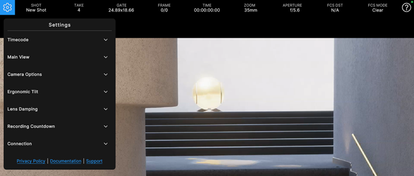
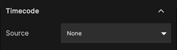
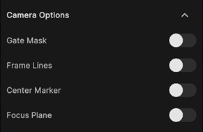
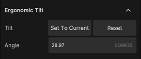
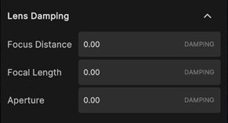
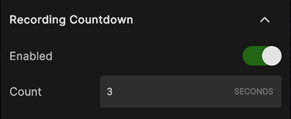
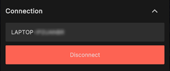

# Virtual Camera settings

To access the app settings, tap the **Settings**  icon in the Information bar at the top left of the screen.

| Settings category | Purpose |
| :--- | :--- |
| **[Timecode](#timecode)** | Connect the app to a timecode source for time synchronization purposes. |
| **[Main View](#main-view)** | Show/hide controls and menus of the app main screen. |
| **[Camera Options](#camera-options)** | Show/hide visual helpers and markers representing physical camera properties. |
| **[Ergonomic Tilt](#ergonomic-tilt)** | Tilt the mobile device orientation relative to the virtual camera orientation. |
| **[Lens Damping](#lens-damping)** | Smoothen the effects resulting from the use of camera lens controls. |
| **[Recording Countdown](#recording-countdown)** | Configure the countdown displayed when you start a recording. |
| **[Connection](#connection)** | Manage the app connection to a Live Capture server. |
| [Links](#links) | Get more information and support about the app. |

## Timecode

Use the Timecode settings to connect the app to a timecode source for [time synchronization](timecode-synchronization.md) with the Unity Editor and other Live Capture compatible devices.

| Property | Description |
| :--- | :--- |
| **Source** | The source to use for [timecode synchronization](timecode-synchronization.md).  **Note:** Make sure to enable Bluetooth on your mobile device to allow the app to detect the timecode source device to connect to. |

## Main View

Use the Main View settings to show or hide the controls and menus available from the [main screen](virtual-camera-app-ui.md) of the app.

| Property | Description |
| :--- | :--- |
| **Show Joysticks** | Toggles the visibility of the joysticks. |
| **Show Camera Settings** | Toggles the visibility of the [motion/reset menu](virtual-camera-app-ui-motion.md) at the left of the screen. |
| **Show Lens Settings** | Toggles the visibility of the [lens menu](virtual-camera-app-ui-lens.md) at the right of the screen. |
| **Show Information Bar** | Toggles the visibility of the [information bar](virtual-camera-app-ui-infobar.md) at the top of the screen.  **Tip:** From the main screen of the app, tap the screen with 3 fingers to quickly display back the information bar when it's hidden. |

## Camera Options

Use the Camera Options settings to show or hide visual helpers and markers representing physical camera properties.

| Property | Description |
| :--- | :--- |
| **Gate Mask** | Toggles the visibility of the [Gate Mask](ref-component-frame-lines.md#gate-properties). |
| **Frame Lines** | Toggles the visibility of the [Frame Lines](ref-component-frame-lines.md#aspect-ratio). |
| **Center Marker** | Toggles the visibility of the [Center Marker](ref-component-frame-lines.md#center-marker). |
| **Focus Plane** | Toggles the visibility of the [Focus Plane](ref-component-focus-plane-renderer.md). |

## Ergonomic Tilt

Use the Ergonomic Tilt settings to tilt the orientation of your mobile device relative to the orientation of the virtual camera in Unity, for a more ergonomic grip.

| Property | | Description |
| :--- | :--- | :--- |
| **Tilt** |  | Buttons to automatically set or reset the tilt. |
|| **Set To Current** | Sets the tilt according to the current orientation of your device. |
|| **Reset** | Resets the tilt to 0. |
| **Angle** || Indicates the current tilt value in degrees, and allows you to manually set one. |

## Lens Damping

Use the Lens Damping settings to smoothen the effects resulting from the use of the camera lens controls.

| Property | Description |
| :--- | :--- |
| **Focus Distance** | Interpolation factor for the focus distance control. |
| **Focal Length** | Interpolation factor for the focal length control. |
| **Aperture** | Interpolation factor for the aperture control. |

>**Note:** The values represent the approximate time it takes to reach the target.

## Recording Countdown

Use the Recording Countdown settings to configure the countdown displayed in the camera view when you start a recording.

| Property | Description |
| :--- | :--- |
| **Enabled** | Use this option to enable or disable the recording countdown. |
| **Count** | The duration of the recording countdown in seconds. |

>**Note:** The actual recording starts when the countdown ends.

## Connection

The Connection settings allow you to manage the connection of the app to a Live Capture server through your local network.

### When the app is already connected

| Property | Description |
| :--- | :--- |
| **Host name** | The name of the computer hosting the server. |
| **Disconnect** | Disconnects the app from the server. |

### If the app is disconnected

| Property | Description |
| :--- | :--- |
| **Scan** | Allows you to select a server to connect to among the ones currently available. |
| **Manual** | Allows you to specify the IP address and port of the server you wish to connect to. |
| _Host name_, or **IP** and **Port** | Specify the information to reach the computer hosting the server you want to connect the app to.  • In **Scan** mode, select the host name. • In **Manual** mode, specify the host IP address and the server port. |
| **Connect** | Connects the app to the specified server. |

>**Note:** To manage the connection on the server side, use Unity Editor's [Connection Window](ref-window-connections.md).

## Links

Use the links to get more information and support about the app.

| Link | Description |
| :--- | :--- |
| **Privacy Policy** | Links to Unity's [Privacy Policy](https://unity3d.com/legal/privacy-policy), which governs the collection, use, storage, and sharing of the information Unity collects or receives from you. |
| **Documentation** | Links to the [Unity Virtual Camera page](virtual-camera.md) of this documentation. |
| **Support** | Links to the official [Unity forum post](https://forum.unity.com/threads/1111255/) about the Live Capture apps, from where you can get general information and support, and provide some feedback on the apps. |
