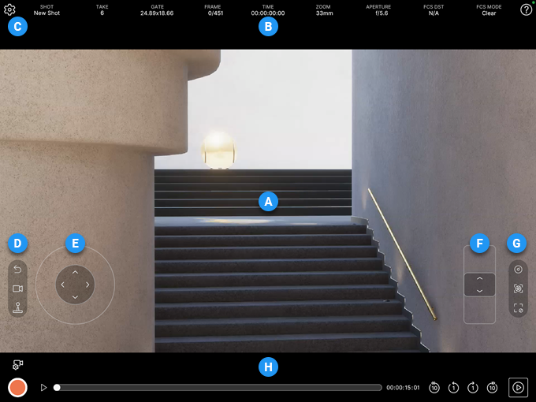

# Virtual Camera app interface reference

|  | **Name** | **Description** |
| :--- | :--- | :--- |
| **A** | Camera view | • In **preview/recording** mode, this is the view of the camera you're controlling in the Unity Editor through the app. The resolution and aspect ratio depend on the Game view current state in the Unity Editor.  • In **playback** mode, this view allows to visualize the recorded result of the currently selected take. |
| **B** | [Information bar](virtual-camera-app-ui-infobar.md) | Recording/playback indicators about the current take, along with the current values of the main camera properties. |
| **C** | [Settings](virtual-camera-app-ui-settings.md) | Icon to access settings relative to timecode, main view, camera display options, ergonomic tilt, lens damping, recording countdown, and server connection. |
| **D** | [Camera motion/reset menu](virtual-camera-app-ui-motion.md) | Menu to access options and properties relative to camera reset, repositioning, damping, motion scale, rotation, and joysticks. |
| **E** | Horizontal motion joystick | Quadridirectional control area to make the camera move horizontally. You can adjust [joystick properties](virtual-camera-app-ui-motion.md#joysticks-setup) through the camera motion/reset menu (**D**). |
| **F** | Vertical motion joystick | Bidirectional control area to make the camera move vertically. You can adjust [joystick properties](virtual-camera-app-ui-motion.md#joysticks-setup) through the camera motion/reset menu (**D**). |
| **G** | [Camera lens menu](virtual-camera-app-ui-lens.md) | Menu to access camera lens controls: focal length (zoom), focus, aperture, and focus mode. |
| **H** | [Recording/playback controls](virtual-camera-app-ui-recplay.md) | All the basic controls to record and play back takes, with an access to the library of all recorded takes, and settings to configure takes for iterative recording. |
