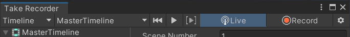

# Get started with the Virtual Camera

Install, connect and set up all elements to drive a Unity camera from the Virtual Camera app.

>**Note:** To get visible results from this setup, use a Scene that includes enough elements to look at through the camera.

## Installation

1. [Install the Live Capture package](installation.md).

2. Install the Unity Virtual Camera app:
   | App name | Device requirements | Link |
   |:---|:---|:---|
   | **Unity Virtual Camera** | iPad or iPhone with: • iOS 14.5 or higher • ARKit capabilities (implied with the required iOS version)|  |

## Connect the app to the Unity Editor

1. Make sure to correctly [set up your local network and firewall](connection-network.md).

2. Open the [Connections window](ref-window-connections.md): from the Unity Editor main menu, select **Window** > **Live Capture** > **Connections**.

3. Create a Connection of type **Companion app Server** and enable it.

4. From the Virtual Camera app, [enable the connection](connection-device.md#companion-app-connection) to the created server.

## Create a Virtual Camera Actor

1. From the Hierarchy, disable any active cameras in the Scene.

2. From the Editor main menu, select **GameObject** > **Live Capture** > **Camera** > **Virtual Camera Actor**.

  A new GameObject containing a Camera component and a Virtual Camera Actor component, among others, should appear in the Hierarchy. This is the camera you're going to drive from the Virtual Camera app.

>**Note:** You can create a Cinemachine Camera Actor if you're using the Cinemachine package as a camera system in your Scene.

## Create a Virtual Camera Device

1. Open the [Take Recorder window](ref-window-take-recorder.md): **Window** > **Live Capture** > **Take Recorder**.

2. In the **Capture Devices** section, click on the **+** (plus) button and select **Virtual Camera Device**.

3. In the Take Recorder window's right pane:
    * Select the **Client Device** you previously connected to the Unity Editor.
    * Set the **Actor** target field to the Virtual Camera Actor you previously created.

## Test the Virtual Camera

1. In the Editor, in the Take Recorder window, make sure the Live mode is enabled.  
   

2. Move your mobile device around.

   The app screen and the Editor Game view should show the content of your Scene through the Unity Camera you're driving and reflect the movements you apply to your mobile device.

## Additional resources

* [Virtual Camera app interface reference](virtual-camera-app-ui.md)
* [Virtual Camera workflows](virtual-camera-workflow.md)
