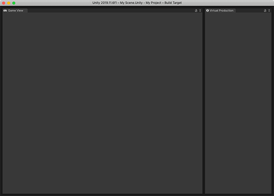

# Getting started

### Tracking tips

* AR camera tracking involves image analysis, which requires a clear image. Patterned surfaces are best.

* Tracking quality is reduced when the camera can’t see details, such as when the camera is pointed at a blank wall or the scene is too dark.

* Walk around the environment a bit before trying to record a performance.

## Optimal editor layout

There is a performance cost for every editor window that is visible. To prevent hitching, use a [custom editor layout](https://docs.unity3d.com/Manual/CustomizingYourWorkspace.html) when capturing data from the device. The layout should only have a **Game View** and a **Connections** window visible.

## Setting up the Take Recorder

1. Create a new GameObject with a **Take Recorder** component by going to **Menu > GameObject > Live Capture > Take Recorder**.
3. Set the shot name using the **Shot** field in the **Take Recorder** component.
3. Select an output directory using the **Directory** field in the **Take Recorder** component.

## Setting up a scene with the Virtual Camera

### Using the basic Virtual Camera Actor

A setup that uses the **Camera** component.
1. Disable any active cameras in the scene.
2. Add the **Virtual Camera Actor** by going to **Menu > GameObject > Create > Live Capture > Camera > Virtual Camera Actor**.

### Using the Cinemachine Camera Actor

Currently **Cinemachine** is used to drive special camera settings and camera position and aim damping.

1. Add the **Cinemachine Camera Actor** by going to **Menu > Assets > Create > Live Capture > Camera > Cinemachine Camera Actor**.

### Creating a Virtual Camera Device

1. In the **Take Recorder** component, click on the **+** button from the **Capture Devices** list.
2. Select **Virtual Camera Device** to create a child GameObject with a **Virtual Camera Device** component.
3. In the newly created **VirtualCameraDevice** component, set a **Virtual Camera Actor** into the **Actor** field.
4. In the same **VirtualCameraDevice** component, select a connected client from the **Client Device** dropdown.

You are now ready to record Takes with your **Companion App**.

## Render pipeline compatibility

| **Feature**         | **Built-in Render Pipeline** | **Universal Render Pipeline (URP)** | **High Definition Render Pipeline (HDRP)** |
| ------------------- | ---------------------------- | ----------------------------------- | ------------------------------------------ |
| **Depth Of Field**  | Yes (1, 2)                    | Yes (2)                             | Yes                                        |
| **Film Format**     | Yes                           | Yes                                 | Yes                                        |
| **Focus Plane**     | Yes                           | Yes                                 | Yes                                        |
| **Video Streaming** | Yes                           | Yes                                 | Yes                                        |

**Notes**:

1. Depends on the Post-Processing Stack V2. The feature will only be activated if `com.unity.postprocessing` is installed.
2. At the moment Depth Of Field is only supported when using the basic Virtual Camera Actor (as opposed to the Cinemachine variant).
